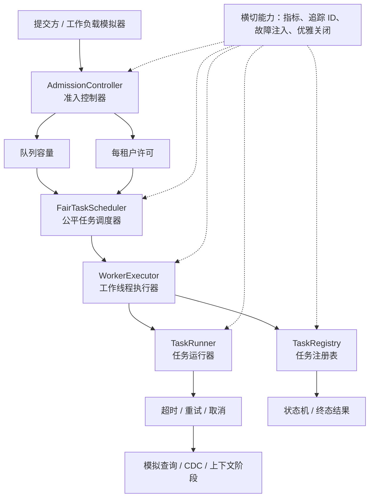
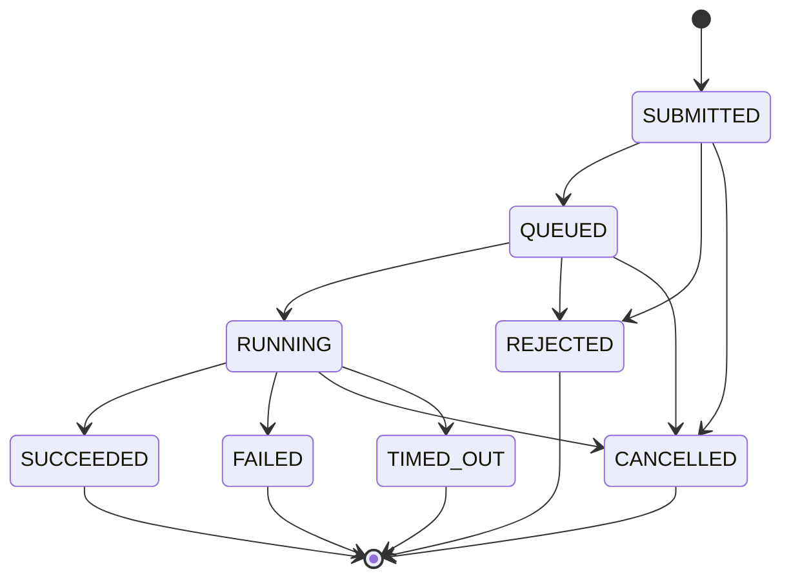
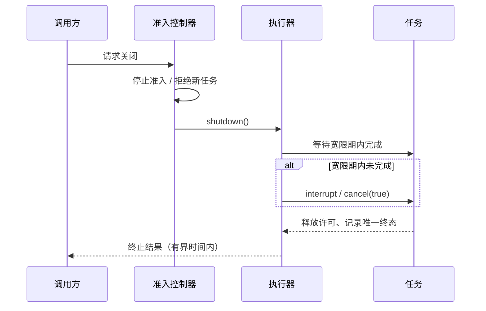
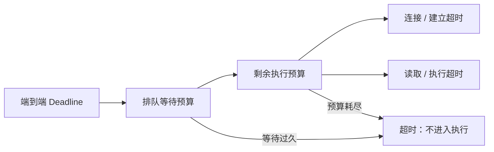

# 六个月工程导师计划

**方向：**Java 并发 → 可靠执行系统 → 查询、流式处理与面向 AI 的数据基础设施
**时间预算：**每周 2 小时专注学习，24 个有效周，合计约 48 小时
**核心产物：**`QueryGate`，一个面向生产、多租户的并发任务执行服务
**节奏原则：**某一周被打断时，整体计划顺延；不产生补课债务。

---

## 1. 当前工程能力画像诊断

你不是初学工程师，但能力结构并不均衡。

你的生产直觉领先于形式化基础和编码流畅度。你常能识别可疑设计、解读日志、缩小故障类别，并讨论系统取舍。这些是许多人工作多年才获得的系统工程能力。你在 Flink、Spark、CDC、SQL、数仓、线上事故和开源方面的经验，提供了理解并发与可靠性价值的真实语境。

薄弱点在于：从想法到能够独立论证的代码之间的路径：

> 问题 → 不变量 → 设计 → 实现 → 对抗性测试 → 诊断 → 解释

你能较好地走完其中的一些环节，尤其是问题理解和诊断；但 AI 经常替你完成了过多实现工作。因此你对知识的把握会感到不确定——你尚未积累足够多“自己能够构建该机制”的重复证据。

当前工作带来了第二个风险。告警处理和跨团队支持可能带来广泛的运维熟悉度，却缺少清晰的所有权、可沉淀的产物以及完整的工程反馈闭环。本计划无法改变你的工作分配，但能给你一个从设计、压测到复盘都由你负责的子系统级闭环。

正确策略不是广泛地完成一套“完整计算机科学”课程，而是构建一条狭窄但高价值的主线：

1. 让 Java 并发知识精确且可执行。
2. 用它构建可靠的多租户执行子系统。
3. 只补充解释该子系统所需的 OS、JVM、网络、查询与流式概念。
4. 将成果连接到面向 AI 的确定性数据基础设施。
5. 每周一道小型算法题，恢复面试中的实现流畅度。

六个月后的目标画像不是“样样精通”，而是：

> 能够独立设计、实现、测试、调试、度量并解释一个有明确边界的并发执行服务，并能将其设计关联到查询引擎、流平台以及为 AI 可靠交付上下文的工程师。

---

## 2. 待补齐的能力缺口（按优先级）

### 优先级 1：独立 Java 实现能力与并发正确性

你需要反复练习：在未先获得实现方案的前提下，把不变量翻译成 Java。这包括 Java 内存模型、安全发布、同步、状态迁移、取消、关闭与有界资源使用。

**为什么优先：**这些能力会同时提升你当前工程工作、开源工作、面试表现和自信心。

### 优先级 2：严谨的正确性习惯

对每个组件，学习明确命名：

- 共享可变状态；
- 合法状态迁移；
- 不变量；
- 同步边界；
- happens-before 边；
- 安全性故障；
- 活性故障；
- 过载行为；
- 故障传播；
- 关闭行为。

代码运行成功一次，并不是并发正确性的证据。

### 优先级 3：拥有一个完整工程闭环

你需要一个连贯的项目，包含设计说明、代码、测试、故障注入、指标、基准测试与最终技术答辩。即使日常工作仍较碎片化，这也会产生可衡量的证据。

### 优先级 4：解释生产行为的运行时基础

选择性学习操作系统、JVM 内部与网络：调度、阻塞、内存、分配、GC、套接字、超时、队列和可观测性。不要试图完成整套课程。

### 优先级 5：查询和流式执行概念

把线程池、调度、队列、公平性、背压、重试和状态机联系到查询间并发、流水线执行、CDC 摄入、检查点与租户隔离。

### 优先级 6：面试实现流畅度

现阶段每周一道题足够，前提是独立完成、测试并解释。目标是在压力下提取模式，而非大量刷题。

### 优先级 7：面向 AI 的数据专业化

仅在执行基础稳定之后，加入元数据、权限校验、新鲜度、溯源和确定性上下文构建边界。避免追逐框架潮流。

---

## 3. 六个月路线图

路线图分为三阶段。每第四周兼作集成检查点。“一周”指完成一次两小时会话，不必等同于自然周。

| 阶段 | 周次 | 核心问题 | 项目结果 |
|---|---:|---|---|
| I. 并发执行基础 | 1–8 | 我能证明 Java 并发代码安全、有活性、有界且可停止吗？ | 具备任务状态、租户限额、取消、过载行为和压力测试的有界执行器 |
| II. 运行时与数据系统执行 | 9–16 | 我能解释并度量执行器如何与 JVM、OS、远程调用、查询流水线和 CDC 背压交互吗？ | 可观测的模拟查询/CDC 工作负载、公平调度、JFR/JMH 证据、重试/去重规则 |
| III. 可靠的面向 AI 数据毕业项目 | 17–24 | 我能把执行器变为可信的确定性上下文服务，并为其设计答辩吗？ | 权限感知的上下文任务、新鲜度/溯源、故障注入、容量报告、设计文档与发布版本 |

### 第 1 月——共享状态与协作

建立对线程、竞态、可见性、有序性、原子性、监视器和等待条件的正确心智模型。产出第一个任务状态机和有界队列。

### 第 2 月——执行生命周期

构建工作线程池、有界准入、租户限额、取消、异常传播、优雅关闭、活性诊断和第一份负载报告。

### 第 3 月——运行时证据

把 Java 行为联系到进程、调度、JVM 内存、垃圾回收、远程 I/O、竞争、伪共享、线程转储、Java Flight Recorder 与严谨基准测试。

### 第 4 月——查询与流式行为

建模查询流水线、查询间调度、公平性、CDC 生产者、背压、重试安全性、幂等性和重复抑制。

### 第 5 月——面向 AI 数据可靠性

加入确定性规划、权限检查、元数据、新鲜度、溯源、可观测性、SLO 和故障注入矩阵。

### 第 6 月——工程证明

审计正确性，简化设计，度量容量，记录决策，复现故障，并在不依赖 AI 生成解释的情况下答辩系统。

---

## 4. 每周两小时操作系统

每周采用相同结构：

| 时间 | 活动 |
|---:|---|
| 0:00–0:10 | 闭卷回忆：写下你记得的上周内容 |
| 0:10–0:25 | 阅读前先预测本周工程问题与故障模式 |
| 0:25–1:25 | 独立实现或调试 |
| 1:25–1:45 | 一道算法题或计划中的重做题 |
| 1:45–2:00 | 运行验收检查并写学习日志 |

阅读应由实现需求驱动，包含在实现的一小时内；不要另加独立阅读大纲。

### 精力不足周的最小可行会话

无法完成两小时时，做 45 分钟：

1. 10 分钟回忆和设计；
2. 25 分钟完成一个狭窄的代码或测试修改；
3. 10 分钟记录下一步的精确行动。

这能保持连续性。不要靠下周翻倍补偿。

### 每周必需产物

每周留下四项小证据：

1. 包含不变量和故障模型的设计说明；
2. 你能逐行解释的代码改动；
3. 至少一个对抗性测试；
4. 一条回答“什么证据改变了我的想法？”的学习日志。

---

## 5. 累积项目：`QueryGate`

`QueryGate` 是一个进程内 Java 服务，接收模拟查询、CDC 与上下文构建任务。它刻意不是完整数据库、网络服务器或 Flink 克隆。

### 概念架构



### 核心任务状态机

起始版本：



你可以修订该状态机，但每个迁移都必须有唯一所有者和测试。终态永不再迁移。

### 初始不变量

1. 已接纳的任务要么已终态，要么仍可在注册表中发现。
2. 一个任务至多到达一个终态。
3. 队列大小永不超过配置容量。
4. 任一租户的运行任务不超过该租户限额。
5. 被拒绝的任务绝不执行。
6. 调用方能区分过载、执行失败、取消和超时。
7. 关闭时拒绝新任务，按文档化策略处理排队任务，必要时中断运行任务，并在上限时间内终止。
8. 仅当任务的安全策略允许时，才可重试。
9. 指标不会悄然改变任务执行正确性。

### 建议仓库结构

```text
query-gate/
  README.md
  pom.xml
  docs/
    invariants.md
    architecture.md
    failure-model.md
    benchmark-report.md
    decisions/
  src/main/java/.../
    task/ queue/ admission/ execution/ scheduling/ metrics/ workload/
  src/test/java/.../
    unit/ stress/ fault/
```

使用 Java 21、Maven 和 JUnit 5。仅在计划推进到相应阶段时加入 JMH 或 jcstress；不要在第 1 周搭建基础设施。

---

## 6. 前八周详解：Java 多线程与高并发

每项核心练习遵循导师协议：

1. 我提供问题和约束，而非实现。
2. 你提交共享状态、不变量、迁移和关闭行为的设计。
3. 你写出第一个版本。
4. 我先审查正确性，后审查风格。
5. 我们加入对抗性测试。
6. 你解释 happens-before 论证和生产关联。
7. 只有验收后才能与参考实现对照。

每周只处理一个主要机制，生产代码约 50–120 行（不含测试）。若验收标准无法在会话内完成，就停在能编译、已测试的边界，下次重复该有效周；不要仓促前进或暗中借用实现。

### 第 1 周——会说谎的完成计数器

**工程问题：**多个工作线程执行模拟查询片段并递增共享完成计数。最终计数偶尔小于已完成片段数。

**概念：**进程与线程、线程私有栈与共享堆、线程创建及 `start`/`run`/`join`/生命周期、调度不确定性、共享可变状态、读改写竞态、原子性、为何 `count++` 不可分割、安全性与活性。

**实现任务：**创建 `CompletionCounterExperiment`：启动由统一开始闸门协调的多个平台线程；每个线程执行大量递增；记录期望值和观测值；实现一个故意不安全计数器及一个使用 `synchronized` 的正确计数器；用 `join` 而非 `sleep` 等待完成。暂不使用执行器、原子类或并发集合。

**调试练习：**从不安全计数器开始，在不同线程数下反复运行。解释一次正确结果为何不能证明安全。只把 `CountDownLatch` 作为测试脚手架以增加竞争概率，暂不要求解释其内部实现。

**预期输出：**线程数、每线程递增数、期望值、观测值的表；至少一次观察到丢失更新（或说明非确定性复现不受保证）；同步版本在反复运行中得到精确终值；一段展示两个递增如何合并为一次的事件交错。

**审查问题：**共享与线程私有的内存分别是什么？直接调用 `run()` 为何不产生并发？`join()` 保证了什么而 `sleep()` 没有？`int` 赋值原子是否足以让 `count++` 安全？修正后计数器的不变量是什么？它如何对应查询片段完成数聚合？

**常见错误：**用 `sleep` 猜测工作线程结束；每次调用锁不同对象；将计数器设为 `volatile` 就以为递增原子；只测一次；混淆“未观察到失败”和“失败不可能”。

**验收：**不借助 AI 生成代码写出两个版本；主线程正确等待每个工作线程；同步版本锁身份明确；能展示三步读/加/写导致丢失更新的交错；将缺陷归类为安全性故障而非“时序问题”。

**生产关联：**并行查询片段、Sink Writer 计数器、指标和完成跟踪都面临“原子读写”与“原子状态迁移”的同一区别。

### 第 2 周——拒绝停止的工作线程

**工程问题：**后台工作线程循环至关闭标志变更，但优化后可能观察不到更新；新启动线程还可能看到未完整发布的配置。

**概念：**可见性与有序性；Java 程序员所需层面的编译器/JIT/CPU 重排；作为允许观察集合的 JMM；程序顺序、同步顺序、`synchronizes-with`、happens-before；`volatile` 读写语义；监视器解锁/加锁及线程 start/join 边；安全发布；不可变状态和 `final` 字段；可见性并非复合原子性。

**实现任务：**实现 `StoppableWorker`，含不可变工作配置、`start()`/`stop()` 生命周期方法、执行小段模拟工作的循环、有界 `awaitTermination` 和已文档化的单次启动策略。先写普通 boolean 版本作为推理产物，再用 `volatile` 修正关闭标志；除非能说出其保护的不变量，否则不加锁。

**调试练习：**检查包含非 volatile 停止标志、从构造器逸出/启动后修改的配置、以 `Thread.sleep` 充当同步的错误版本。对每种情形画出存在或缺失的 happens-before 边。目标是推理，不要求每台机器都复现可见性缺陷。

**预期输出：**构造 → `start()` → 工作线程读取的图；调用方 volatile 停止写 → 工作线程 volatile 停止读的图；启动、观察进展、停止并在截止时间内 join 的测试；解释 `volatile int count; count++` 仍不安全的一段话。

**审查问题：**存在数据竞态时 JMM 允许什么行为？哪个精确动作发布配置？`volatile` 是否使周围操作互斥？为何中断最终应成为阻塞操作的首选取消机制？两个调用方并发 `start()` 会怎样？安全发布如何出现于算子初始化或配置刷新？

**常见错误：**把 volatile 说成“直接读主内存”而非 happens-before；只用停止标志、不处理阻塞调用；构造中让 `this` 逸出；吞掉 `InterruptedException`；声称测试证明所有可见性缺陷均不存在。

**验收：**关闭在测试上限内终止；配置不可变或安全发布；能列出日常 Java 中至少四条 happens-before 规则；能用此代码区分可见性、有序性、原子性；设计明确生命周期迁移的所有者。

**生产关联：**Source Reader 关闭、查询取消、配置发布和工作线程生命周期在成为框架问题前，首先都是 JMM 问题。

### 第 3 周——拥有两个最终结果的任务

**工程问题：**完成、取消和超时彼此竞争。任务必须恰好拥有一个终态。

**概念：**原子变量、CAS、乐观状态迁移、线性化点、CAS 周围重试循环、原子引用与锁保护的复合状态、无锁推理的局限、了解 ABA 但不实现高级无锁结构。

**实现任务：**创建 `TaskState` 和 `TaskRecord`，使用 `AtomicReference<TaskState>` 实现合法迁移：`SUBMITTED -> QUEUED`、`QUEUED -> RUNNING`、`RUNNING -> SUCCEEDED | FAILED | CANCELLED | TIMED_OUT`、`SUBMITTED | QUEUED -> CANCELLED`。方法必须报告调用方是否赢得迁移。第一版先不加入结果/错误字段，除非能使其与状态一致发布。

**调试练习：**测试同时释放完成线程和取消线程。错误版本使用“检查再执行”：

```java
if (!terminal) {
    state = CANCELLED;
}
```

多次执行协调竞态，并断言恰有一个迁移获胜。

**预期输出：**状态迁移表；标记非法迁移的图；双竞争者测试；CAS 线性化点的书面识别；说明何时会用一把锁替代多个原子变量的决策记录。

**审查问题：**`compareAndSet` 精确原子化了什么？两个各自原子的字段为何仍可能构成不一致对？线性化点在哪里？终态 CAS 后才写结果会怎样？何时锁更易证明？如何映射查询的 `RUNNING`、`CANCELLED`、`FINISHED` 竞态？

**常见错误：**确认 CAS 成功前就做副作用；允许从终态迁出；为耦合不变量用独立原子变量；发布 `SUCCEEDED` 后才写结果；未证明进展性就称代码“无锁”。

**验收：**只有合法迁移能成功；恰一个终态竞争者获胜；终态安全发布关联的不可变结果或错误；测试协调竞争者而非只依赖随机 sleep；能针对该状态机论证 CAS 或锁的选择。

**生产关联：**查询状态、检查点状态、异步请求完成与取消都需要唯一权威终态迁移。

### 第 4 周——从第一原则实现有界队列

**工程问题：**生产者提交快于工作线程消费。无界列表最终耗尽内存；有界队列必须正确阻塞，同时不丢失、不重复任务。

**概念：**内置锁与监视器所有权、可重入性、守护块、`wait`/`notifyAll`/等待集、条件谓词、虚假唤醒、为何在循环中等待、生产者-消费者、作为显式策略的背压、可中断等待。

**实现任务：**从头实现 `MonitorBoundedQueue<T>`：固定容量；一个内置锁；满时等待的 `put(T)`；空时等待的 `take()`；采用一致同步策略的 `size()`；中断传播。这是学习组件，生产代码稍后用标准 `BlockingQueue` 取代。

**调试练习：**构造错误版本或推演改动：`while` 换成 `if`；无充分理由地把 `notifyAll` 换成 `notify`；在锁外检查谓词；吞掉中断；持有队列锁时调用未知任务代码。使用多生产者/消费者、唯一任务 ID 与线程安全测试结果集检测缺失或重复。

**预期输出：**不变量 `0 <= size <= capacity`；“未满”和“非空”的谓词表；统计每个提交 ID 的压力测试；阻塞生产者或消费者的中断测试；第 1 月检查点记录。

**审查问题：**`wait()` 为什么释放监视器而 `sleep()` 不释放？唤醒后为何必须重检条件？哪个线程会将每个谓词从假改为真？在队列锁下运行用户代码为何危险？阻塞是否是唯一背压策略？过载时无界邮箱对流式算子意味着什么？

**常见错误：**`if` 代替 `while`；忘记所有受保护状态访问须遵循同一锁策略；状态改变前通知；返回内部可变存储；实现出错时测试可无限挂住。

**验收：**容量永不超过上限；协调测试中已接纳项不丢失、不重复；阻塞操作可中断；测试有时间边界，不会无限挂住整套测试；能解释安全性及活性仍依赖生产者/消费者的位置。

**生产关联：**有界邮箱、Source 到 Sink 的失衡、准入队列、网络缓冲区都会将超额需求转换成等待、拒绝、丢弃或失败。

### 第 1 月检查点

仅在无需笔记即可做到以下各项时通过：区分原子性、可见性、有序性并各举例；画出 `synchronized`、`volatile`、`start`、`join` 的 happens-before 边；实现正确的同步计数器；解释并测试一个单终态 CAS 迁移；实现监视器有界队列中央的 `put`/`take` 逻辑；在每个组件中指出一个安全性和一个活性风险。

前四项任一失败，第 5 周改为巩固周；不新增原语。

### 第 5 周——多条件与租户许可

**工程问题：**一个队列条件唤醒过多无关等待者，且嘈杂租户可能占满所有工作线程。

**概念：**`ReentrantLock`、`Condition`、可中断加锁、`try/finally` 所有权纪律、公平性及吞吐代价、用信号量表示许可、闭锁与屏障协调工具、多资源获取引入的死锁前提。

**实现任务：**用一个 `ReentrantLock` 与 `notEmpty`/`notFull` 两个条件重写 `LockBoundedQueue<T>`；添加每租户一个 `Semaphore` 的 `TenantLimiter`；返回一个 `close()` 恰好释放一次的小许可对象，以便任务使用 `try/finally` 或 try-with-resources。测试用 `CountDownLatch` 协调启动；做一个小 `CyclicBarrier` 实验，但没有真实用处不放入生产代码。

**调试练习：**异常路径遗漏解锁；任务失败时泄漏租户许可；以不一致顺序获取队列/资源锁和租户许可；比较公平与非公平信号量，但不声称一次短运行能证明公平性。

**预期输出：**两个守护谓词和各条件的 signal 方；证明租户运行数不超限的测试；证明失败路径归还许可的测试；锁顺序说明；监视器与显式锁版本的简短比较。

**审查问题：**`Condition` 相比单一监视器等待集增加什么能力？为何 `unlock()` 必须在 `finally`？公平锁是否保证应用级公平？如果任务在等待全局满队列前取得租户许可会怎样？信号量保护数据还是表示容量？租户槽位如何类似共享查询集群的准入控制？

**验收：**队列仍满足第 4 周测试；成功、失败、取消、已有拒绝路径均无许可泄漏；租户限额不被突破；锁与许可获取顺序有文档；能说明生产中为何应用标准库队列替代教学队列。

### 第 6 周——有界执行器与显式过载

**工程问题：**服务接收工作的速度快于完成速度。默认执行器选择会隐藏无界队列或失控建线程，异常也可能消失。

**概念：**`Executor`、`ExecutorService`、`Callable`、`Future`；`ThreadPoolExecutor` 的核心线程数、最大线程数、存活时间与队列交互；有界 `BlockingQueue`、拒绝策略、准入与执行的区别、并发集合和复合操作、线程工厂与未捕获异常处理、`execute` 和 `submit` 的异常可见性、作为直觉而非死记公式的 Little 定律。

**实现任务：**用显式构造的 `ThreadPoolExecutor` 创建 `AdmissionExecutor`：可配置固定工作线程数；有界队列；命名线程；将拒绝转为 `REJECTED_OVERLOADED` 等领域结果；接入 `TaskRegistry` 和 `TenantLimiter`；记录已接纳/拒绝/运行/完成计数；不使用无界执行器工厂。主项目以合适标准 `BlockingQueue` 替换自定义队列，教学实现保留为实验室。

**调试练习：**让任务等待闭锁，确定性填满工作线程和队列；再提交一个任务并验证选定拒绝行为。各创建一个在 `execute` 和 `submit` 下抛异常的任务，观察故障在哪里报告。

**预期输出：**工作线程数、队列容量、拒绝策略配置表；不依赖机器速度的饱和测试；两种提交方式可见的失败结果；可对账的指标；解释常见配置下无界队列为何使最大线程数预期失效。

**验收：**本层内存由显式工作线程和队列容量限制；饱和产生确定且可观察结果；每个已接纳任务可在注册表追溯；任务失败被显式暴露而不是偶然写日志；能解释每个执行器参数及交互。

### 第 7 周——取消、超时、重试与关闭

**工程问题：**调用方超时、工作线程阻塞并且关闭开始。系统必须区分超时和失败，协作停止工作，归还许可，并避免不安全的重复重试。

**概念：**中断作为协作取消、interrupt 状态、阻塞方法与 `InterruptedException`、无法继续抛出时恢复中断状态、取消竞态、截止时间与经过时长超时、`Future.cancel(true)`、异常传播、优雅/强制关闭、重试安全性、幂等性与副作用。

**实现任务：**加入每任务截止时间、取消操作、保留 Future 或其他显式句柄以观察异步失败、在长 CPU 循环中检查中断的任务代码，以及两阶段关闭：停止准入，等待宽限期，再中断剩余工作。为显式幂等的模拟读取写 `RetryPolicy` 决策表，实际实现推迟到第 16 周；不要实现通用重试框架。

**调试练习：**使用四种故障任务：可中断 sleep、阻塞队列等待、检查中断的 CPU 循环、故意忽略中断的坏循环。观察关闭并为坏场景获取线程转储。再加入每次都抛异常的任务，证明保留终态错误。

**预期输出：**关闭时序图；取消运行前、运行中、超时与完成竞态、异常保留测试；模拟 `SELECT`、元数据读取、CDC 应用、外部副作用的重试安全表；关闭时排队任务处理文档。



**审查问题：**Java 为什么不能安全强杀任意线程？捕获 `InterruptedException` 后代码应做什么？取消调用方等待与停止底层工作有何区别？完成与超时竞争时谁拥有最终状态？为什么“重试三次”不是正确性策略？查询取消和 Flink Job/Operator 取消如何依赖协作边界？

**验收：**协作任务在文档化上限内停止；坏任务被诊断且不会无限挂住测试进程；Future/错误可保留、可观察；每条退出路径都释放租户许可和其他资源；重试资格显式化，实际重试推迟至第 16 周；关闭策略先写后实现。

### 第 8 周——活性、压力测试与首份性能证据

**工程问题：**服务在常规测试下正确，但可能死锁、饿死某租户或在竞争下崩溃。你需要区分正确性与性能的证据。

**概念：**死锁、活锁、饥饿、公平性；Coffman 死锁条件；锁顺序与开放调用；压力测试与确定性协调；线程转储及 blocked/waiting 状态；吞吐、延迟分位数、排队等待、拒绝率；预热和测量误差；竞争；缓存行与伪共享的概念；基准结果不是正确性证明。

**实现任务：**构建 `QueryGateLoadScenario`，支持多个租户和可配置任务时长；记录提交、接纳、拒绝、成功、失败、取消数；记录排队等待和执行时长分布；只改变一个变量，比较故意高竞争设计与较低竞争设计；加入一个小 jcstress 测试（第 2 或第 3 周原语）或反复双参与者压力工具。对账不变量通过前不得调优。

**调试练习：**在仅测试的实验中创建双锁死锁；捕获线程转储并识别所有者和等待者；用全局锁顺序或消除嵌套获取修正；描述一个活锁例子和一个饥饿场景；检查全局指标锁是否成为竞争点。

**预期输出：**不变量对账报告；一份带标注的线程转储；吞吐、p50/p95 延迟、排队等待、拒绝数的小负载表；前后竞争比较及限制；将伪共享联系到频繁更新计数器的一段解释；第 2 月检查点记录。

**验收：**负载下所有记账等式成立；从证据而非猜测诊断故意死锁；修正后的生产路径采用有文档锁顺序或避免嵌套锁；性能结果包含工作负载、机器/JDK、预热局限且不夸大；能分别解释 `QueryGate` 的安全性、活性、性能与可维护性。

### 第 2 月检查点

通过阶段 I 的标准：能画出完整 `QueryGate` 共享状态图；为每把锁、原子变量、信号量、队列、并发集合辩护；演示有界过载行为；取消并关闭协作任务且不泄漏许可；暴露异步异常；由线程转储诊断测试死锁；解释测试提供证据但不是数学证明；30 分钟内从空文件重写一个中心组件。若状态机、有界性或关闭失败，先重复集成周再进入运行时主题。

---

## 7. 第 9–24 周：具体练习与交付物

这些周仍以项目为导向，但刻意比阶段 I 少规定细节。每周仍采用设计 → 实现 → 测试 → 解释闭环。

### 第 9 周——进程、线程、调度与阻塞

**问题：**为什么增加工作线程数反而可能降低吞吐？

**工作：**在 CPU 密集、sleep、锁阻塞、队列等待的任务下，用线程转储观察 `QueryGate`。记录线程状态，并关联可运行工作、上下文切换和 CPU 核数。使用机器上可得的 OS 观察工具，但不开始内核学习。

**交付：**`docs/runtime-observations.md`，包括四类工作负载、预测行为、观测线程状态和一次工作线程数量实验。

**验收：**能区分进程资源和线程资源、可运行与正在运行、阻塞与等待、并发与并行。

### 第 10 周——JVM 内存、分配、GC 与安全点

**问题：**工作负载存在延迟尖刺，但没有明显锁竞争。

**工作：**创建高分配任务及倾向复用的对照版本。采集短时 Java Flight Recorder（JFR）档案。识别分配率、一次 GC 暂停观察、热点方法和线程活动；不调优垃圾收集器。

**交付：**一张带注释的 JFR 截图或文本摘要，以及假设/证据表。

**验收：**能解释栈、堆、对象生命周期、分配压力、GC 暂停与应用锁暂停的区别，以及一次录制不是普遍证据的原因。

### 第 11 周——远程调用、TCP 直觉与超时预算

**问题：**“查询”调用一个模拟远程服务，它可能慢、不可用或只返回部分进展。

**工作：**增加 `RemoteStage` 抽象，区分连接/建立超时和执行/读取超时；必要时仅模拟，无须真实服务器。把单个端到端截止时间贯穿排队等待和执行。测试慢响应、无响应、调用方超时后的延迟成功。

**交付：**超时预算图，以及证明队列时间会减少剩余执行时间的测试。



**验收：**能解释重试为何放大负载、调用方超时为何不自动取消远程工作、TCP 连接/读取/应用截止时间为何是不同关注点。

### 第 12 周——重新审视度量、竞争与伪共享

**问题：**判断全局计数器/锁是否是真正瓶颈。

**工作：**为一个孤立问题创建最小 JMH 基准，例如在不同竞争下比较 `AtomicLong` 与 `LongAdder`。包含预热和多 fork；仅为调查已测行为时才可选地检查对象布局或填充。

**交付：**`docs/benchmark-report.md`，含问题、假设、设置、结果、限制、决策；完成第 3 月检查点。

**验收：**能区分微基准结果和端到端容量；当项目正确性语义不同，不盲目采用“赢家”。

### 第 3 月检查点

- 用至少两个竞争性假设和证据解释一次延迟尖刺。
- 解读线程转储和小型 JFR 录制。
- 解释 CPU 密集和 I/O 密集线程池为何有不同容量压力。
- 让一个截止时间穿过队列与执行。
- 为一个基准结论辩护而不夸大。

运行时工具消耗太多时间时，保留一个录制样例后继续；工具熟练度不是目标。

### 第 13 周——查询执行流水线

**问题：**一个查询包含扫描、过滤、聚合阶段，具有不同阻塞和 CPU 行为。

**工作：**将有限查询建模为三阶段任务或小型有向无环图（DAG）。记录各阶段耗时，区分查询间并发和查询内并行。数据在内存生成；不实现 SQL 解析或存储。

**交付：**一张执行图和可运行的 `SimulatedQueryPlan`。

**验收：**能解释流水线与阻塞阶段、为何每阶段加线程会过度订阅机器、背压应位于何处。

### 第 14 周——公平的多租户调度

**问题：**一个租户填满 FIFO 队列，另一个租户的小任务被其全部工作挡在后面。

**工作：**实现最简单的隔离改进：每租户队列加轮询选择。保持全局和每租户有界；定义租户限额不等时的行为。

**交付：**按租户展示排队等待的前后工作负载，以及解释公平/吞吐取舍的 ADR。

**验收：**任何租户均不超限；队列内存保持有界；在已文档化假设下，持续活跃租户不能无限饿死另一活跃租户。

### 第 15 周——流式生产者与背压

**问题：**CDC 生产者产生事件快于消费者应用事件。

**工作：**增加限速 `CdcWorkload`。跟踪已生产位置、已接纳位置、已处理位置、队列延迟、拒绝/阻塞时间。概念上比较阻塞、拒绝、减慢生产者策略，只实现其中一种。

**交付：**延迟随时间表或图，以及策略说明。

**验收：**能解释缓冲只是延迟而非消除过载，并关联队列容量、吞吐失配、延迟和恢复时间。

### 第 16 周——交付语义、幂等性与去重

**问题：**任务可能完成副作用后，在确认完成前失败。

**工作：**向一个模拟 CDC 应用或元数据更新路径加入幂等键。在副作用前、后以及确认后注入失败。实现小型有界去重记录或确定性插入或更新规则。

**交付：**故障点表，映射每种失败到重试结果和重复风险；完成第 4 月检查点。

**验收：**能区分执行、确认、持久副作用、重试、最终提交；不在未定义边界和持久状态的情况下声称“恰好一次”。

### 第 4 月检查点

- 用自己的代码解释查询间与查询内并发。
- 在可复现负载下演示租户公平性提升。
- 定量解释流式积压。
- 展示哪些失败使重试安全或不安全。
- 将项目关联到你见过的一个真实 Flink/CDC 或查询引擎事故模式。

调度代码若变复杂，删除权重和优先级；保持有界轮询和可理解不变量。

### 第 17 周——面向 AI 的确定性上下文规划

**问题：**智能体请求上下文，但必须在语义推理之前确定性地解析权限和所需源。

**工作：**加入 `ContextRequest`、`ContextPlan`、`ContextTask`。确定性规划器选择被授权的结构化数据、元数据、模拟文档。权限拒绝在检索工作进入执行器之前发生。

**交付：**上下文计划模式和证明禁止源绝不被调度的测试。

**验收：**权限执行不委托给 LLM，每个被选源都有明确理由与身份。

### 第 18 周——新鲜度、版本与 CDC 驱动上下文

**问题：**答案使用的上下文内部一致，但已过期。

**工作：**为上下文结果附加源版本、模式版本、事件位置和观测时间。模拟快照加 CDC 更新。定义新鲜度要求，并拒绝或标注不满足的结果。

**交付：**溯源记录和覆盖更新竞态的新鲜度测试。

**验收：**能区分事件时间、处理/观测时间、持久源位置和“对此请求足够新鲜”。

### 第 19 周——指标、追踪与服务等级目标

**问题：**整体延迟看似健康，但一个租户却有排队饥饿和超时。

**工作：**加入追踪 ID 和结构化生命周期事件。报告排队等待、执行延迟、端到端延迟、结果、重试数、租户。为模拟器定义两个适度的 SLO 风格目标。

**交付：**一份追踪叙事和每租户负载报告。

**验收：**指标与任务状态可对账；维度有界；排队等待独立于执行；日志保留单个任务因果链。

### 第 20 周——故障注入活动

**问题：**在过载和部分失败下验证系统，而不只验证正常路径。

**工作：**对饱和、慢任务、抛出异常、尝试泄漏许可、忽略中断、可重试失败、不可重试副作用、负载中关闭构成小矩阵。

**交付：**`docs/failure-model.md`，逐项记录预期结果、实际结果、证据和修复；完成第 5 月检查点。

**验收：**没有故障被静默吞没；每次有界测试后不变量可对账；已知不协作任务被如实报告。

### 第 5 月检查点

- 演示“权限先于检索”。
- 为一个上下文结果追踪新鲜度和溯源。
- 诊断一次租户专属 SLO 失败。
- 不依赖人工时序猜测地运行故障矩阵。
- 解释哪些系统决策是确定性的，哪些可合理使用 AI 协助。

若上下文层削弱执行器清晰度，就把它保留为薄的强类型工作负载。不要构建嵌入向量、向量库或智能体框架。

### 第 21 周——正确性审计与简化

**问题：**功能积累速度快于正确性证明。

**工作：**审计每个共享字段和状态迁移。删除冗余原子变量、锁、指标或抽象。写出状态、所有者、同步策略和不变量表。

**交付：**`docs/invariants.md` 和至少一次简化提交。

**验收：**每个可变共享字段都有已文档化策略；没有锁只因“线程安全”而存在；终态和关闭的所有权仍无歧义。

### 第 22 周——容量曲线与一次有依据的优化

**问题：**为一个声明的工作负载找出饱和点与主导瓶颈。

**工作：**在多种并发度下运行同一负载。记录吞吐、p95 延迟、排队等待、拒绝、CPU 行为和租户分布。最多做一次优化后重跑。

**交付：**容量表、瓶颈假设、证据、变更与前后结果。

**验收：**测试具备支持狭窄结论的可复现性；拒绝任何以破坏公平或正确性换取吞吐的改动。

### 第 23 周——作品集级设计与事故文档

**问题：**让未看过构建过程的审阅者也能读懂工程工作。

**工作：**编写架构与组件职责；关键不变量和 happens-before 论证；过载、重试、关闭策略；三个被拒绝方案；一个来自注入失败的简短事故报告；基准限制；查询、流式与面向 AI 数据的关联。

**交付：**完整 `README.md`、`docs/architecture.md` 和一份事故报告。

**验收：**每项主要主张都链接到代码、测试或度量证据；删去任何可描述任意项目的泛泛主张。

### 第 24 周——最终技术答辩与发布

**问题：**证明知识属于你，而不只是存在于仓库中。

**工作：**1）从空文件重写一个有界状态迁移或小型阻塞组件；2）调试一个此前未见的植入并发缺陷；3）录制 15 分钟架构说明；4）回答下方答辩问题；5）打 `v1.0` 标签或以其他方式记录版本。

**最终答辩问题：**最重要的三个不变量是什么？关键 happens-before 边在哪？什么有界、什么仍可能增长？谁拥有取消和终态？异步失败如何暴露？调用方观察到什么过载策略？租户如何被饿死？哪些重试安全及其原因？真实查询引擎或 Flink 算子内部会如何不同？哪些确定性边界使服务适合 AI 上下文交付？

**交付：**最终演示、答辩录制/笔记、发布提交和下一阶段六个月的差距评估。

**验收：**无需请求 AI 生成解释，即可从代码和证据回答。

---

## 8. AI 协助规则

AI 是导师、审阅者、对抗测试者和文档导航员；它不是核心练习的首位实现者。

### 协助阶梯

对核心练习，按顺序经过以下级别：

| 级别 | AI 可以做什么 |
|---:|---|
| 0 | 前 20 分钟不用 AI：写问题模型、共享状态、不变量、建议 API |
| 1 | 提苏格拉底式问题并识别遗漏关注点；不给代码或伪代码 |
| 2 | 给出一个局部概念提示，或指向一个相关 API/文档章节 |
| 3 | 为困难片段给伪代码，不给可编译类 |
| 4 | 审阅你的可编译尝试，指出缺陷并建议最小修改，不重写 |
| 5 | 验收后提供参考实现供比较 |

第一次尝试失败时，不要从级别 0 直接跳到级别 4。

### 从一开始就允许的行为

- 询问术语澄清；
- 询问官方文档位置；
- 请 AI 测验你；
- 请 AI 审查设计但不产出代码；
- 在你写完初始测试计划后，请 AI 提出对抗性场景；
- 先自行阅读并形成假设后，请 AI 解释编译错误。

### 核心实现期间受限的行为

- 首次可编译尝试前不生成完整类；
- 不复制无法逐行解释的代码；
- 不让 AI“修复所有测试”；
- 不因某原语看似可用就直接接受它；
- 不把 AI 写的设计说明当作自己的提交；
- 在找到最小失败不变量之前不做大范围重构。

### 任意 AI 协助代码的所有权测试

只有能够做到以下各项，代码才算属于你：解释每个共享字段和同步操作；预测删除锁、`volatile`、CAS 或中断检查后的行为；写出对抗测试；无需再生成即可为变更需求修改代码；一周后从空文件重建中心机制。做不到时，将组件标记为“借来的，尚未学会”，然后重新学习。

### 与我作为导师沟通的提示词格式

```text
问题：
我的不变量：
共享可变状态：
建议同步方案：
故障与关闭行为：
我已尝试的内容：
证据：
请求的协助级别（1-5）：
```

我应在技术上严格：先区分正确性、安全性、活性、性能、可维护性；再给出足以推动你前进的最少明确帮助。

---

## 9. 轻量算法面试轨道

每周严格做 **一道 20 分钟题**。检查点周从空编辑器重做旧题，而不是新增题。这是最小但可持续的有效剂量。

### 二十分钟流程

1. **2 分钟：**复述输入、输出、约束和样例。
2. **4 分钟：**说出暴力解法与目标模式。
3. **10 分钟：**不用 AI 或自动补全生成逻辑地实现。
4. **4 分钟：**测试边界并说明时间/空间复杂度。

未完成也在 20 分钟停止，记录推理断点；核心会话后学习缺失思路，在下一个检查点周重做。不要把一道题变成两小时竞赛。

### 每周序列

| 周次 | 模式 / 题目 |
|---:|---|
| 1 | 数组 + 哈希表：两数之和 |
| 2 | 栈：有效括号 |
| 3 | 二分：有序数组中的首次出现 |
| 4 | 从空白重做第 1–3 周中最弱题 |
| 5 | 滑动窗口：无重复字符的最长子串 |
| 6 | 堆：前 K 个高频元素 |
| 7 | 链表：反转链表 |
| 8 | 重做第 5–7 周中最弱题 |
| 9 | 双指针：去重或有序数组两数之和 |
| 10 | 树 BFS：层序遍历 |
| 11 | 树 DFS：最大深度并解释递归栈 |
| 12 | 重做第 9–11 周中最弱题 |
| 13 | 图/网格 DFS 或 BFS：岛屿数量 |
| 14 | 区间：合并区间 |
| 15 | 堆：合并 K 个有序流/链表（小 K） |
| 16 | 重做第 13–15 周中最弱题 |
| 17 | 回溯：子集 |
| 18 | 基础 DP：爬楼梯，并说明递推式 |
| 19 | 链表环检测 |
| 20 | 重做第 17–19 周中最弱题 |
| 21 | 单调栈：每日温度 |
| 22 | 二分：旋转排序数组 |
| 23 | 队列/哈希表设计：小型 LRU 缓存设计；20 分钟内可只完成部分实现 |
| 24 | 随机选择并录制 20 分钟内解决一道旧题 |

### 面试证据

维护一页记录：模式、识别信号、不变量、常见边界、时间/空间复杂度、首次解决日期、从空白重解日期。

六个月后的成功不是“解决 24 道题”，而是在适度时间限制下识别并独立实现此处代表的核心模式。

---

## 10. 衡量真实理解

### 证据阶梯

主题不是因为听起来熟悉就算学会。使用五级：

| 级别 | 证据 |
|---:|---|
| 0. 识别 | 被提示时能识别术语 |
| 1. 解释 | 能用自己的话解释机制 |
| 2. 构建 | 能从空文件实现中心思想 |
| 3. 对抗性证明 | 能陈述不变量并创建暴露错误变体的测试 |
| 4. 迁移 | 能将概念用于变化后的查询、流式或生产场景 |

核心并发主题必须达到级别 3 后才前进。整体阶段对有界执行、取消、背压至少需要级别 4。

### 每周评分卡

每个维度 0–3 分：

- **正确性：**实现是否在对抗性交错下满足不变量？
- **机制：**能否用 JMM/API 术语解释为何有效？
- **实现：**能否不依赖生成写出核心？
- **调试：**能否用证据定位植入缺陷？
- **迁移：**能否关联查询/流式/数据基础设施？

主题以 **12/15** 通过；正确性和机制任一不得低于 2。

### 每个并发组件的必答证明问题

1. 共享什么状态？
2. 不变量是什么？
3. 若适用，哪个操作是线性化点？
4. 什么建立可见性？
5. 是否有操作阻塞，阻塞多久？
6. 中断或异常时发生什么？
7. 资源是否可能泄漏？
8. 什么是有界的？
9. 如何关闭？
10. 删除同步后哪个测试会失败？

### 间隔复查

学习一个原语一周后，不看笔记用 10 分钟重建其核心机制。一月后用不同组件解释它。若做不到，降低该主题的证据级别，而非维持乐观评分。

---

## 11. 每月检查点与调整规则

### 检查点格式

在第 4、8、12、16、20、24 周：运行项目测试；从空白重写一个旧机制；调试一个植入或故意重新引入的缺陷；解释一个生产关联；更新评分卡和下月风险。

### 调整规则

- **验收标准通过不足 70%：**重复一个集成周，不新增主题。
- **一个核心不变量失败：**修复前停止功能工作。
- **两个会话超时：**缩小下个里程碑功能范围，不增加学习时长。
- **实现通过、解释失败：**做执行轨迹/交错练习，不加更多代码。
- **解释通过、空白实现失败：**不用 AI 重做更小实现。
- **连续两个检查点都很轻松：**增加对抗条件或修改一个约束，不增加另一项技术。
- **工作或健康中断：**保留最后一个通过检查点，写下下一精确动作，从那里恢复。
- **算法轨道反复超过 20 分钟：**用模式重做替代新题，直到流畅度提高。
- **项目抽象增殖：**删除一个功能，恢复从提交到终态的可见执行路径。

### 月度导师审查问题

- 现在能实现什么一个月前不能实现的内容？
- 哪个主张由测试或度量支持？
- 哪个组件仍是“借来的，尚未学会”？
- 哪个故障让你意外？
- 下个月应删除什么？
- 项目在哪里连接到真实工作或开源经验？

---

## 12. 有意延后的主题

这些主题有价值，但在这 48 小时计划中的回报较低：

- 平台线程语义扎实前的虚拟线程、结构化并发、响应式框架；
- Netty 内部机制和高性能网络服务器；
- 高级无锁队列、危险指针、自定义同步器；
- 深入 CPU 缓存一致性协议或汇编级 JIT 分析；
- 选择并调优每一种 JVM GC；
- 完整 OS、计算机体系结构或网络课程；
- SQL 解析器、基于成本优化器、存储引擎、事务管理器；
- 完整 Flink 源码学习或迷你 Flink；
- Kubernetes、服务网格、云认证路线；
- 向量数据库内部、嵌入向量模型训练、快速变化的 RAG 框架；
- 通用智能体编排和提示工程课程；
- 本计划期间学习 Rust、Go、Scala 或其他实现语言；
- 竞赛编程题量；
- 高级动态规划、图论、形式化验证；
- 为 `QueryGate` 制作精致网页用户界面。

被主题分心时，把它记入“停车场”笔记。只有当前验收标准需要它时才进入计划。

---

## 13. 推荐资源

不要从头到尾读完任何一本。只使用当前练习所需章节。

### 阶段 I，第 1–8 周：Java 并发

- **主要资源：**Brian Goetz 等，[《Java 并发实践》](https://www.informit.com/store/java-concurrency-in-practice-9780321349606)。选择线程安全、对象共享、任务执行、取消、活性、性能相关内容。
- **补充资源：**[Java SE 官方文档](https://docs.oracle.com/en/java/javase/21/docs/api/java.base/java/util/concurrent/package-summary.html)，尤其是 JLS 第 17 章和 `java.util.concurrent`。从官方文档导航到练习所需的精确 API 或规范章节。

### 阶段 II，第 9–16 周：运行时与数据系统执行

- **主要资源：**[《操作系统：三本易读的书》](https://research.cs.wisc.edu/wind/OSTEP/)。只选进程、线程、调度、条件变量及有限内存/I/O 章节。
- **补充资源：**[CMU 15-445/645](https://15445.courses.cs.cmu.edu/spring2026/syllabus.html) 中查询执行和并行执行的选读笔记/课程。不要尝试完整课程或项目。

### 阶段 III，第 17–24 周：可靠数据与面向 AI 的数据

- **主要资源：**Martin Kleppmann、Chris Riccomini，[《数据密集型应用系统设计》第二版](https://www.oreilly.com/library/view/designing-data-intensive-applications/9781098119058/)。按项目需要选择编码/模式、复制/流、数据一致性、批流处理、可信系统章节。
- **补充资源：**你自己的项目证据，以及所用具体 Java/JVM 工具的官方文档；这刻意不是另一门课程。

算法轨道不设独立主要资源；24 个题目和模式笔记在本阶段足够。

---

## 14. 六个月后的预期能力与作品集证据

### 应具备的能力

你应能够：

- 从共享内存第一原则解释 Java 并发；
- 使用 happens-before 而不是经验传言进行推理；
- 在 `synchronized`、`volatile`、原子变量、显式锁、信号量、并发集合间选择；
- 实现并测试有界生产者-消费者组件；
- 配置有界执行器并为其过载行为辩护；
- 设计具有单一终态的任务状态机；
- 传播取消、截止时间、中断和异步失败；
- 定义安全的重试和幂等边界；
- 发现许可/资源泄漏；
- 用线程转储和运行时证据诊断死锁与竞争；
- 做有限且诚实的性能度量；
- 解释租户隔离、公平性、排队和背压；
- 将查询间执行、CDC 延迟和上下文构建负载连接到相同执行原则；
- 在 AI 推理前强制确定性权限、新鲜度、溯源和查询边界；
- 解决并解释轻量轨道中的核心面试模式；
- 将 AI 用作审阅者和导师，而不放弃代码所有权。

### 作品集证据

仓库应包含：可运行的 Java 21 `QueryGate`；单测、协调并发、压力和故障注入测试；有界队列教学实现及使用标准并发工具的生产路径；任务注册表和显式状态机；有界执行器、租户限制器、公平调度、取消、超时、重试、关闭行为；模拟查询、CDC、权限感知上下文负载；可对账指标和追踪示例；一份带标注的死锁/线程转储调查；一次 JFR 观察；一个严谨微基准；一份说明限制的容量/负载报告；不变量、架构、故障模型、基准文档；若干 ADR；一份注入事故报告；最终技术答辩录制或笔记；含间隔重做的算法模式笔记。

### 这些证据应让你在面试中如何表述

不要说：

> “我学过许多并发 API。”

而要说：

> “我构建并答辩了一个有界多租户执行服务。我可以展示其任务状态不变量、happens-before 关系、过载与关闭策略、取消竞态、公平性取舍、故障测试和容量度量。之后我把同一执行模型用于模拟查询、CDC 和权限感知的上下文工作负载。”

这是一个建立在独立产出证据之上的连贯工程故事。

---

## 15. 开始导师制：你的第一份提交

暂时不要实现第 1 周。先发送以下设计：

```text
第 1 周：完成计数器

1. 哪些数据是共享的？
2. 精确的正确性不变量是什么？
3. 哪种交错会违反它？
4. 主线程如何知道所有工作线程已完成？
5. 测试如何提高竞争概率？
6. 哪些结果能证明、哪些不能证明正确性？
7. 你建议的类/API 形态是什么？
8. 请求协助级别：0 或 1
```

第一次导师审查应挑战设计和测试策略，而不直接给出实现。
