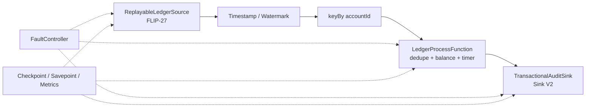

# Flink 精通工程课程

**定位：**面向已经写过 Flink JAR、理解常用 DataStream API，希望从“会开发作业”进阶到“能证明运行时语义、独立实现连接器、诊断复杂故障并主持升级”的工程师。

**技术基线：**Apache Flink **2.3.0**、Java **17**、Maven、经典 DataStream API。

**主线 API：**经典 DataStream、FLIP-27 Source、Sink V2。

**实验轨道：**DataStream API V2、State V2、ForSt 一律标记为 **[Experimental]**，只做隔离实验，不作为生产毕业项目的正确性依赖。

**时间预算：**12 个递进 Lab 阶段，每阶段 4–6 小时，总计 **48–72 小时**；建议节奏约 65 小时。

**核心产物：**`LedgerFlow`，一个可重放 Source、有状态事件时间计算、事务型 Sink、可保存点升级并具备故障证据的累积项目。

---

## 1. 与现有导师计划的关系

本课程与 [六个月 QueryGate 工程导师计划](./ENGINEERING_MENTORSHIP_PLAN.md) **并列，而不是替代关系**。

| 路线 | 主要问题 | 核心证明对象 |
|---|---|---|
| QueryGate / Java 并发 | 单 JVM 内共享状态如何安全、有活性、有界且可停止？ | happens-before、线性化点、取消、过载、资源生命周期 |
| Flink 精通课程 | 分布式数据流在并行、故障、重放、检查点、扩缩容和外部副作用下如何保持语义？ | 分区所有权、一致切面、状态/位置联合恢复、端到端提交、升级兼容 |

两条路线共享同一学习纪律：先写不变量，再独立实现；先预测故障，再运行实验；先建立可复现证据，再下结论。QueryGate 的并发基础会帮助你读懂 Mailbox、异步回调、取消和资源清理；Flink 课程不会把“以前写过 JAR”当成已经掌握运行时的证据。

推荐安排：

- 已完成 QueryGate 前 8 周：可直接开始本课程。
- 两条路线并行：一次只推进一个 Flink 模块，不在同一周同时攻克两个新机制。
- 工作中断：停在最近一个通过门槛，不制造补课债务。

本文件是课程契约和实验路线，不重复网站中的课程正文。真正的理解来自预测、实现、源码追踪、故障注入和答辩，而不是继续增加阅读量。

---

## 2. 版本边界与风险标记

### 2.1 固定基线

所有课程结论首先针对以下组合：

```text
Apache Flink: 2.3.0
Java:         17
API:          classic DataStream + FLIP-27 Source + Sink V2
Build:        Maven
Mode:         STREAMING
```

每份实验报告必须记录：

```text
Flink artifact version:
JDK vendor/version:
OS/architecture:
State backend:
Checkpoint storage:
Parallelism/maxParallelism:
Checkpoint mode:
Relevant configuration:
Flink source branch and commit:
```

课程文档链接固定到 `flink-docs-release-2.3`，源码链接固定到 Apache Flink 官方 `release-2.3` 分支；不要在同一份论证中混用 `stable`、`master`、旧版本博客或其他发行版文档。

- [Flink 2.3 Release Notes](https://nightlies.apache.org/flink/flink-docs-release-2.3/release-notes/flink-2.3/)
- [Flink 2.3 Architecture](https://nightlies.apache.org/flink/flink-docs-release-2.3/docs/concepts/flink-architecture/)
- [Flink 2.3 官方源码](https://github.com/apache/flink/tree/release-2.3)

### 2.2 API 风险分层

| 层级 | 本课程用法 | 约束 |
|---|---|---|
| 生产主线 | 经典 DataStream API | 累积项目的拓扑、状态、时间与测试均以此实现 |
| 生产主线 | FLIP-27 Source | 独立实现 split/enumerator/reader，验证恢复和扩缩容 |
| 生产主线 | Sink V2 | 独立实现 writer/committable/committer，证明外部可见性 |
| **[Experimental]** | DataStream API V2 | 只比较编程模型与执行图，不迁移累积项目 |
| **[Experimental]** | State V2 | 只研究异步状态访问、执行顺序与兼容风险 |
| **[Experimental]** | ForSt | 只在独立 profile 中研究远端状态和异步 I/O，不给生产推荐 |

FLIP-27 Source 和 Sink V2 名称里虽有“新 API”的历史语境，但它们是本课程的主线，不与 DataStream API V2 混为一谈。

### 2.3 版本敏感规则

1. `@Public`、`@PublicEvolving`、`@Experimental`、`@Internal` 是不同契约；能读到内部类，不代表应用代码可以依赖它。
2. 配置键、默认值、指标名、REST 字段、内部调用链和 connector 兼容矩阵都可能跨版本变化。
3. 外置 connector 有自己的版本线；“Flink 2.3.0”不自动证明任意 Kafka/JDBC connector 版本兼容。
4. 源码锚点用于解释机制，不用于让业务代码调用内部 API。
5. 升级前必须重读 2.3 release notes、目标版本 release notes、升级文档和 connector 兼容说明。
6. `release-2.3` 分支仍可能包含补丁；源码实验要记录实际 commit，不用行号作为长期知识。
7. 任何 **[Experimental]** 结论都必须带上“仅在此版本、此配置、此实验成立”，不得直接转化为生产建议。

---

## 3. 精通的可观察定义

完成课程后，“精通”不是记住大量类名，而是能独立完成以下闭环：

> 业务语义 → 数据流不变量 → 运行时所有权 → 一致性协议 → 故障点 → 可观测证据 → 恢复证明 → 版本边界

你应能做到：

1. 从一段 DataStream 代码推导 `StreamGraph -> JobGraph -> ExecutionGraph -> Task/OperatorChain`。
2. 解释一个 subtask 中记录、timer、checkpoint callback、operator event 为什么不会随意并发修改 operator state。
3. 计算 key-group 所有权并预测扩缩容后的状态迁移。
4. 对给定记录、watermark、idle input 和 timer 序列逐步推导输出。
5. 区分 live state、state backend、checkpoint storage、checkpoint metadata 和 externalized checkpoint。
6. 画出 aligned/unaligned checkpoint 的一致切面，说明 channel state 是否包含某条记录。
7. 区分“Flink 内部 exactly-once state”与“外部系统 exactly-once visibility”。
8. 实现并验证 FLIP-27 Source 的 split 所有权、位置快照、失败归还和序列化兼容。
9. 实现并验证 Sink V2 的 pre-commit、committable、幂等 commit、未知提交结果和恢复。
10. 用指标、线程栈、checkpoint 统计、火焰图和负载实验建立背压因果链。
11. 从 savepoint 跨 JAR、状态 schema 和并行度升级，并能安全回滚。
12. 面对复合故障先预测结果，再用证据判断是正确性、活性、容量还是运维问题。

---

## 4. 统一学习协议

### 4.1 每阶段 4–6 小时的固定循环

建议将一个模块拆成两次会话，避免在疲劳状态下“看懂源码但没有留下证据”。

| 环节 | 建议时间 | 必须回答的问题 |
|---|---:|---|
| 闭卷预测 | 20–30 分钟 | 我认为记录、状态、线程、barrier 和外部副作用会怎样变化？ |
| 不变量与故障模型 | 30–40 分钟 | 什么绝不能发生？谁拥有迁移？崩溃点在哪里？ |
| 定向官方阅读 | 30–45 分钟 | 哪一条文档主张需要通过实验验证？ |
| 独立实现 | 60–90 分钟 | 我能否不复制参考实现写出最小机制？ |
| 可控实验 | 45–60 分钟 | 如何控制输入、时序、并行度和完成条件？ |
| 源码追踪 | 35–50 分钟 | API 如何进入 runtime？线程上下文和状态所有者是谁？ |
| 故障注入 | 35–50 分钟 | 删除、延迟、重复或崩溃后，哪个不变量应仍成立？ |
| 证据归档与答辩 | 20–30 分钟 | 哪个证据改变了我的原判断？结论边界是什么？ |

压缩到 4 小时时，可以缩短延伸阅读和性能矩阵，但不能删除不变量、故障注入、源码锚点和通过门槛。扩展到 6 小时时，只增加一个更强对抗条件，不平行增加新技术。

### 4.2 每阶段必需产物

```text
evidence/module-N/
  prediction.md          # 运行前预测
  invariants.md          # 不变量、所有者、故障边界
  experiment.md          # 环境、步骤、原始观察、结论边界
  source-trace.md        # 入口、调用链、线程、状态、生命周期
  failure-matrix.md      # 注入点、预期、实际、解释
  explain-back.md        # 闭卷答辩
  artifacts/             # plan JSON、指标、日志、快照摘要等
```

“截一张 Web UI 图”不算实验报告。必须保留配置、输入、故障触发条件、完成条件、断言以及可重复运行的方法。

### 4.3 源码阅读协议

每次只沿一个问题追踪，不顺序通读整个模块：

1. 从公开 API、日志栈或指标名找到入口。
2. 写出最多 5–8 个关键类的调用链。
3. 为每一步标注运行位置：client、JobManager、TaskManager、task thread、I/O thread、async snapshot thread。
4. 标注状态所有者、生命周期和异常传播路径。
5. 提炼一个运行时不变量。
6. 故意修改最小条件，写出一个会破坏该不变量的测试。
7. 标注 API 稳定级别；内部类只用于理解。

### 4.4 AI 使用边界

沿用 QueryGate 的协助阶梯：

- 先自行提交预测、不变量、伪执行轨迹和首次实现。
- AI 可以审查故障矩阵、追问遗漏、定位官方入口。
- 首次可编译实现前，不让 AI 生成完整 Source、Sink 或状态算子。
- 故障首次出现时，先保存证据并提出三个候选原因，再请求诊断。
- 只有能闭卷重建核心机制、解释每个状态字段并写出破坏性测试，代码才算属于你。

---

## 5. 累积项目：`LedgerFlow`

`LedgerFlow` 是一个故意缩小外部依赖、放大 Flink 语义的账务变更流。它不是生产账务系统，也不是迷你 Flink。

### 5.1 事件与结果

输入事件：

```text
LedgerChange(
  sourcePartition,
  sourceOffset,
  operationId,
  accountId,
  eventTime,
  amountDelta,
  schemaVersion
)
```

输出结果：

```text
AccountSnapshot(
  accountId,
  balance,
  finalizedEventTime,
  appliedOperationCount,
  sourcePositionDigest
)
```

同一个 `operationId` 可能因重放再次到达；不同 source partition 可能乱序、停顿或动态出现。业务规则要求按 `accountId` 维护余额、去重、在事件时间 timer 到达后生成审计快照，并把结果通过事务型 Sink 暴露。

### 5.2 最终拓扑



### 5.3 项目不变量

1. 一个 source split 在同一 execution attempt 中至多由一个 active reader 拥有。
2. source checkpoint state 表示“下一条尚未对 Flink 发出的记录位置”，恢复不得跳过已确认切面之后的数据。
3. 同一 `accountId` 在任一时刻只由一个 keyed subtask 修改其 keyed state。
4. 同一 `operationId` 对余额至多产生一次业务影响；去重状态与余额必须位于同一一致性边界。
5. event-time 快照只在对应 timer 得到 watermark 许可后生成；idle input 和 late event 策略显式化。
6. 已完成 checkpoint 中的 source position、operator state、timer state、in-flight channel state（若有）和 sink committable 属于同一逻辑切面。
7. 未完成 checkpoint 的外部 staged 数据不可对读者可见。
8. 同一 committable 被重复提交时，外部可见结果不重复；未知提交结果可安全重试或被可靠核对。
9. 任何失败后，最终外部结果与无故障参考执行在已声明语义下等价。
10. savepoint 升级后 operator UID、maxParallelism、state name 和 serializer compatibility 满足恢复契约。
11. 背压可增加延迟，但不能悄然丢记录、越过业务去重或绕过 checkpoint 协议。
12. 所有测试有完成上限；SourceReader、writer、committer 和辅助线程在 cancel/close 后无资源泄漏。

### 5.4 建议仓库结构

```text
flink-mastery-lab/
  pom.xml
  README.md
  docs/
    architecture.md
    invariants.md
    checkpoint-timeline.md
    source-protocol.md
    sink-protocol.md
    upgrade-runbook.md
    incident-reports/
    evidence/
  src/main/java/.../
    domain/
    source/
    operator/
    sink/
    fault/
    metrics/
  src/test/java/.../
    model/
    operator/
    connector/
    mini-cluster/
    chaos/
    compatibility/
  src/experimental/java/.../
    datastreamv2/
    statev2/
    forst/
```

默认测试使用确定性、可重放的本地 partition log 和可检查的事务审计存储，避免把 Docker、Kafka 或对象存储故障误判为 Flink 机制。真实 Kafka、数据库或对象存储放在可选 profile 中，用于迁移验证，不作为所有模块的前置条件。

---

## 6. 十二个递进 Lab 阶段总览

网站的 12 个模块按知识主题组织，便于阅读和检索；本文件的 12 个 Lab 阶段按 `LedgerFlow`
实现依赖与故障证明顺序组织。两套编号不是一一对应关系，下面显式给出映射，后文提到“阶段 N”
时一律指 Lab 阶段。

| Lab 阶段 | 网站预读模块 | 建议时长 | 核心问题 | 累积里程碑 |
|---:|---|---:|---|---|
| 1 | 01 分布式 Dataflow 与运行时 | 5h | 一段 JAR 如何成为分布式执行图？ | 固定 UID/maxParallelism，保存执行计划 |
| 2 | 01 分布式 Dataflow 与运行时 | 5h | 一个 subtask 如何串行处理记录、timer、mail 和 checkpoint？ | 建立 task-thread 时间线 |
| 3 | 01 运行时、03 状态、06 恢复升级 | 5h | key、partition、key-group 与并行度如何决定状态所有权？ | 证明 key-group 映射 |
| 4 | 02 时间、水位线与定时器 | 5.5h | watermark 如何把“不再等待”变成可计算边界？ | 事件时间与 late-data 规则 |
| 5 | 03 状态、Key Group 与序列化 | 5.5h | 状态保存在哪里，何时可恢复，如何兼容升级？ | 去重/余额状态与 backend 矩阵 |
| 6 | 04 Checkpoint 与 Exactly-once | 6h | 分布式 checkpoint 如何形成一致切面？ | aligned/unaligned 对照实验 |
| 7 | 04 Checkpoint、06 Rescaling/Failover | 5h | 失败、重放和恢复到底保证了什么？ | 可复现 failover 语义矩阵 |
| 8 | 07 FLIP-27 Source | 6h | 如何正确实现 FLIP-27 Source？ | 可重放、可扩缩容 Source |
| 9 | 08 Sink V2 与 Connector 正确性 | 6h | 如何把 Flink 一致性延伸到外部 Sink？ | 事务型 Sink V2 |
| 10 | 05 网络反压、10 性能诊断 | 5h | 背压如何穿过网络、buffer 和 operator chain？ | 容量曲线与瓶颈证据 |
| 11 | 06 恢复升级、11 生产运维 | 5h | 如何安全做 savepoint、扩缩容、schema/JAR 升级与回滚？ | 跨版本项目升级演练 |
| 12 | 09 SQL、10 性能、12 源码毕业审计 | 6h | 能否在复合故障下答辩全链路，并判断实验特性风险？ | Chaos 证明包与最终答辩 |

反向索引：网站模块 01 → Lab 1–3，02 → Lab 4，03 → Lab 3/5，04 → Lab 6/7，
05 → Lab 10，06 → Lab 3/7/11，07 → Lab 8，08 → Lab 9，09 → Lab 12，
10 → Lab 10/12，11 → Lab 11，12 → Lab 12。

---

## 7. Lab 阶段 1：从 DataStream 代码到分布式执行图

**核心问题：**你写下的 operator、运行时 task、并行 subtask、operator chain、slot 和 execution attempt 分别是什么？

**官方入口：**

- [Flink Architecture](https://nightlies.apache.org/flink/flink-docs-release-2.3/docs/concepts/flink-architecture/)
- [Jobs and Scheduling](https://nightlies.apache.org/flink/flink-docs-release-2.3/docs/internals/job_scheduling/)
- [Parallel Execution](https://nightlies.apache.org/flink/flink-docs-release-2.3/docs/dev/datastream/execution/parallel/)

### 核心不变量

1. logical transformation 不等于 physical task；并行度把一个逻辑节点展开为多个 subtask。
2. 可 chain 的相邻 operator 可以同步运行在同一 task thread，但 shuffle、显式 chaining 策略或资源边界会切断 chain。
3. operator UID 是有状态升级身份的一部分；显示名称不是可靠状态身份。
4. maxParallelism 决定 key-group 空间上界，不能把它当普通性能参数随意更改。
5. slot sharing 表达“允许共享”，不是“保证共址”。

### 必须掌握的机制链

```text
StreamExecutionEnvironment
  -> Transformation list
  -> StreamGraph
  -> JobGraph / JobVertex
  -> ExecutionGraph / ExecutionJobVertex
  -> ExecutionVertex
  -> ExecutionAttempt
  -> TaskManager Task / StreamTask
```

比较 operator parallelism、maxParallelism、slot sharing group、chain、exchange mode 和 restart 后 attempt number。能够把 Web UI 节点映射回代码中的 UID，而不是只凭名称猜测。

### 实验产物

1. 建立 `LedgerFlow` 空骨架：FLIP-27 内置测试 source → map → `keyBy` → `KeyedProcessFunction` → 测试 sink。
2. 为所有有状态节点设置稳定 `uid`、明确 `name` 和 maxParallelism。
3. 保存执行计划 JSON；分别运行并行度 1、2、4，以及 chaining 开/关版本。
4. 在 `graph-mapping.md` 中列出：每个 transformation、chain、JobVertex、subtask 数、slot-sharing group、输入分区方式。
5. 解释为什么“算子数 × 并行度”不能直接等于进程数、线程数或 slot 数。

### 故障注入

- 删除一个有状态 operator 的 UID，比较新旧执行计划中的 operator identity。
- 在 lambda 中捕获不可序列化对象，记录错误发生在 client 构图、提交还是 TaskManager 运行阶段。
- 把一个会阻塞的 map 放入 chain，再 `disableChaining()`，先预测故障隔离和背压边界如何改变。

### 源码锚点

- [`StreamExecutionEnvironment`](https://github.com/apache/flink/blob/release-2.3/flink-runtime/src/main/java/org/apache/flink/streaming/api/environment/StreamExecutionEnvironment.java)
- [`StreamGraphGenerator` 所在包](https://github.com/apache/flink/tree/release-2.3/flink-runtime/src/main/java/org/apache/flink/streaming/api/graph)
- [`StreamingJobGraphGenerator` 所在包](https://github.com/apache/flink/tree/release-2.3/flink-runtime/src/main/java/org/apache/flink/streaming/api/graph)
- [`ExecutionGraph` 所在包](https://github.com/apache/flink/tree/release-2.3/flink-runtime/src/main/java/org/apache/flink/runtime/executiongraph)
- [`DefaultScheduler`](https://github.com/apache/flink/blob/release-2.3/flink-runtime/src/main/java/org/apache/flink/runtime/scheduler/DefaultScheduler.java)

追踪问题：`executeAsync()` 之后，在哪一步发生 operator chaining？JobVertex 在何处展开为 ExecutionVertex？UID 在哪一步参与 OperatorID 生成？

### 通过门槛

- 给一张含不同并行度、一个 shuffle、一个 chained segment 的图，闭卷算出 JobVertex、subtask 和关键网络边。
- 能从执行计划和 Web UI 双向定位任一有状态 operator。
- 植入不可序列化捕获后，能在运行前预测失败位置并由证据验证。
- 评分至少 19/24，运行时机制维度至少 3 分。

---

## 8. Lab 阶段 2：Task、OperatorChain 与 Mailbox 单线程语义

**核心问题：**为什么 operator callback 通常串行，却仍然会出现异步线程安全、阻塞和 checkpoint 一致性问题？

**官方入口：**

- [Task Lifecycle](https://nightlies.apache.org/flink/flink-docs-release-2.3/docs/internals/task_lifecycle/)
- [Process Function](https://nightlies.apache.org/flink/flink-docs-release-2.3/docs/dev/datastream/operators/process_function/)

### 核心不变量

1. 同一 StreamTask 中对 operator 的正常调用由 task thread 串行执行。
2. chained operator 的记录传递通常是同线程同步方法调用，不经过网络队列。
3. 外部线程完成的异步工作不能直接并发修改 keyed/operator state；需要通过框架规定的线程/回调边界回到一致执行上下文。
4. 默认 action 必须保持可推进；长时间阻塞 `processElement`、`pollNext` 或 callback 会饿死 mailbox、timer、barrier 和 cancel。
5. 异步异常必须进入 Flink failure path；只写日志会制造“作业 RUNNING 但机制已死亡”。

### 必须掌握的机制

- `Task` 与 `StreamTask` 生命周期：restore、initialize/open、mailbox loop、finish/close/cancel。
- Mailbox default action 与 mails 的协作。
- input availability、output availability 与 task idle/backpressured/busy 的关系。
- timer thread 只负责触发，实际 operator action 如何回到 task thread。
- operator event、checkpoint trigger、async snapshot completion 和 external async callback 的线程边界。

### 实验产物

1. 在 map、process、timer、checkpoint listener、close 中记录 thread name、subtask、attempt、sequence number。
2. 对 chained/unchained 两个版本生成执行时间线，证明哪些调用共享线程。
3. 写一个 mailbox-friendly 的异步结果回传实验；同时保留一个错误版本，让后台线程直接改共享对象。
4. 在 task thread 中加入受控阻塞，记录 mailbox latency、busy/backpressured/idle 指标和 checkpoint 行为。
5. 为每种 callback 写清楚：调用线程、允许访问的状态、异常如何传播、cancel 时如何清理。

### 故障注入

- `processElement` 阻塞 10 秒，期间触发 timer、checkpoint 和 cancel。
- 后台线程抛异常但只记录日志；再改为通过 async exception path 失败作业。
- close 时遗漏 executor shutdown，使用线程快照证明资源泄漏。
- 在异步 callback 与 checkpoint 之间制造竞争，证明直接改普通字段不能获得 operator-state 一致性。

### 源码锚点

- [`StreamTask`](https://github.com/apache/flink/blob/release-2.3/flink-runtime/src/main/java/org/apache/flink/streaming/runtime/tasks/StreamTask.java)
- [`MailboxProcessor`](https://github.com/apache/flink/blob/release-2.3/flink-runtime/src/main/java/org/apache/flink/streaming/runtime/tasks/mailbox/MailboxProcessor.java)
- [`StreamOneInputProcessor`](https://github.com/apache/flink/blob/release-2.3/flink-runtime/src/main/java/org/apache/flink/streaming/runtime/io/StreamOneInputProcessor.java)
- [`RegularOperatorChain`](https://github.com/apache/flink/blob/release-2.3/flink-runtime/src/main/java/org/apache/flink/streaming/runtime/tasks/RegularOperatorChain.java)
- [`RecordWriterOutput`](https://github.com/apache/flink/blob/release-2.3/flink-runtime/src/main/java/org/apache/flink/streaming/runtime/io/RecordWriterOutput.java)

追踪问题：`runMailboxLoop()` 的 default action 如何消费输入？output 不可用时谁 suspend、谁 resume？checkpoint trigger 如何避免与 operator state 并发修改？

### 通过门槛

- 给出 record、timer、mail、barrier 同时到达的场景，能区分“排队顺序不保证”与“operator 调用不会并发”。
- 植入阻塞后，能从线程栈和指标解释 checkpoint 延迟，而不是笼统归因于“Flink 慢”。
- 所有辅助线程在 cancel/close 后终止，异步异常能使测试确定失败。
- 闭卷画出一个 StreamTask 的主循环和四种外部事件进入路径。

---

## 9. Lab 阶段 3：Partition、Key-Group、并行度与状态所有权

**核心问题：**同一 key 为什么会到同一个 subtask，扩缩容时它的状态又如何移动？

**官方入口：**

- [Parallel Execution](https://nightlies.apache.org/flink/flink-docs-release-2.3/docs/dev/datastream/execution/parallel/)
- [Working with State](https://nightlies.apache.org/flink/flink-docs-release-2.3/docs/dev/datastream/fault-tolerance/state/)

### 核心不变量

1. 在同一 topology/version 中，key selector 与 key serialization 必须确定；同一 key 映射到固定 key-group。
2. 一个 key-group 在同一 operator attempt 中只属于一个 subtask。
3. 改变 parallelism 重新分配 key-group；不改变 key-group 内 key 的逻辑归属。
4. 改变 maxParallelism 会改变 key-group 空间，是状态兼容性事件，不是普通扩缩容。
5. `rebalance`、`rescale`、`broadcast`、`global`、`forward` 和 `keyBy` 表达不同分发语义；负载均衡不等于业务 key 均衡。

### 必须掌握的机制

- 逻辑 key、hash、key-group、key-group range、subtask index。
- `keyBy` 前后 network exchange 和 serialization 边界。
- operator state 的 even-split/union 分发与 keyed state 的 key-group 分发。
- mutable key、非确定 hash/serializer、数据倾斜和 hot key。
- parallelism、maxParallelism、slot 数和机器数互不等价。

### 实验产物

1. 使用 `KeyGroupRangeAssignment` 对 100 个确定 key 生成 `key -> keyGroup -> subtask` 表。
2. 在并行度 2、3、4 下运行，验证同一 maxParallelism 时 key-group 不变、owner 可变。
3. 为 `LedgerProcessFunction` 记录每个 account 的 owner；断言同一 attempt 中不出现双 owner。
4. 制造一个 hot account，分别观测 keyBy、rebalance 和错误随机 key 的吞吐/语义。
5. 画出 keyed state、list operator state、union list state 在 2→3 扩容时的预期分发。

### 故障注入

- key 对象在 `keyBy` 后被修改。
- KeySelector 使用非确定随机值或依赖本地时区/进程状态。
- 从 savepoint 恢复时显式修改 maxParallelism。
- 让 90% 数据集中到一个 key，证明增加并行度不能拆分单 key 状态。

### 源码锚点

- [`KeyGroupRangeAssignment`](https://github.com/apache/flink/blob/release-2.3/flink-runtime/src/main/java/org/apache/flink/runtime/state/KeyGroupRangeAssignment.java)
- [`KeyedStream`](https://github.com/apache/flink/blob/release-2.3/flink-runtime/src/main/java/org/apache/flink/streaming/api/datastream/KeyedStream.java)
- [`StreamPartitioner` 实现目录](https://github.com/apache/flink/tree/release-2.3/flink-runtime/src/main/java/org/apache/flink/streaming/runtime/partitioner)
- [`StateAssignmentOperation`](https://github.com/apache/flink/blob/release-2.3/flink-runtime/src/main/java/org/apache/flink/runtime/checkpoint/StateAssignmentOperation.java)

追踪问题：key hash 在哪里变成 key-group？key-group range 如何由 parallelism 计算？restore 时哪个组件把旧 state handle 分配给新 ExecutionJobVertex？

### 通过门槛

- 不运行代码，手工预测给定 key、maxParallelism 和 parallelism 下的 owner，再用官方 helper 校验。
- 能解释为什么 savepoint 可改变 parallelism，却不能随意改变 maxParallelism。
- hot-key 实验有数据分布和 subtask 指标证据，不能只说“数据倾斜”。
- 状态所有权、分区语义、负载均衡三者的解释互不混淆。

---

## 10. Lab 阶段 4：Event Time、Watermark、Timer 与 Window 生命周期

**核心问题：**分布式系统无法知道未来事件，Flink 如何用 watermark 把“继续等待还是完成计算”变成显式策略？

**官方入口：**

- [Generating Watermarks](https://nightlies.apache.org/flink/flink-docs-release-2.3/docs/dev/datastream/event-time/generating_watermarks/)
- [Windows](https://nightlies.apache.org/flink/flink-docs-release-2.3/docs/dev/datastream/operators/windows/)
- [Process Function](https://nightlies.apache.org/flink/flink-docs-release-2.3/docs/dev/datastream/operators/process_function/)

### 核心不变量

1. watermark 是事件时间进度声明，不是 wall-clock，也不是某条记录的确认。
2. 多输入 operator 的有效 watermark 受所有 active input/channel 的最小进度约束。
3. idle input 只有被明确识别后才不再拖住下游 watermark；错误标 idle 可能使后来记录变 late。
4. event-time timer 绑定当前 key，并在 watermark 达到相应时间边界后由 task thread 执行。
5. allowed lateness 决定窗口状态保留/再触发策略，不等于“自动纠正所有乱序”。
6. watermark alignment 控制不同 source/split 的事件时间漂移；checkpoint barrier alignment 形成状态切面，二者完全不同。

### 必须掌握的机制

- timestamp assigner、periodic/punctuated generator 的职责。
- source split watermark、input channel watermark、operator watermark 的传播。
- idleness、watermark alignment、backlog processing。
- `KeyedProcessFunction` event-time/processing-time timer、timer 去重与 cleanup。
- window assigner、trigger、evictor、allowed lateness、late-data side output、state cleanup。
- bounded source 结束时的 max watermark 与 timer flush。

### 实验产物

1. 建立两个可控 source partition，手工发出 record、watermark、idle/active 事件。
2. 用 `KeyedProcessFunction` 实现账户审计 timer，同时用一个 window 版本作对照。
3. 为至少 12 步输入序列先写逐步预测：当前输入 watermark、operator watermark、registered timers、state、main output、late side output。
4. 让一个 partition 停顿；比较无 idleness、正确 idleness、过早 idleness。
5. 启用 watermark alignment，证明它限制 source 时间进度而非 checkpoint barrier。

### 故障注入

- 一个 partition 永不发 watermark 且不 idle。
- 发出远未来 timestamp，使下游提前清理状态。
- idle 后恢复并发送早期记录。
- 注册 timer 后忘记清理关联状态。
- 把 processing-time timer 误当业务事件时间边界，重启后比较结果。

### 源码锚点

- [`WatermarkStrategy` 所在包](https://github.com/apache/flink/tree/release-2.3/flink-core/src/main/java/org/apache/flink/api/common/eventtime)
- [`TimestampsAndWatermarksOperator`](https://github.com/apache/flink/blob/release-2.3/flink-runtime/src/main/java/org/apache/flink/streaming/runtime/operators/TimestampsAndWatermarksOperator.java)
- [`StatusWatermarkValve`](https://github.com/apache/flink/blob/release-2.3/flink-runtime/src/main/java/org/apache/flink/streaming/runtime/watermarkstatus/StatusWatermarkValve.java)
- [`InternalTimerServiceImpl`](https://github.com/apache/flink/blob/release-2.3/flink-runtime/src/main/java/org/apache/flink/streaming/api/operators/InternalTimerServiceImpl.java)
- [`WindowOperator`](https://github.com/apache/flink/blob/release-2.3/flink-runtime/src/main/java/org/apache/flink/streaming/runtime/operators/windowing/WindowOperator.java)

追踪问题：每个 channel 的 watermark 在哪里取最小值？idle status 如何改变 valve？timer queue 何时推进？window cleanup timer 与 trigger timer 有何区别？

### 通过门槛

- 对乱序、idle、late event 和 timer 的混合序列逐条预测完全正确。
- 能解释 watermark、barrier、source offset、processing time 四种“进度”分别证明什么。
- 错误 idle/future timestamp 注入必须稳定暴露业务错误，而不是依赖偶然 sleep。
- 能从源码链说明 timer callback 最终为何仍在 task thread 修改状态。

---

## 11. Lab 阶段 5：Managed State、Backend、TTL 与序列化演进

**核心问题：**状态的逻辑 API、TaskManager 本地存储、checkpoint 持久化和 serializer compatibility 分别解决什么问题？

**官方入口：**

- [Working with State](https://nightlies.apache.org/flink/flink-docs-release-2.3/docs/dev/datastream/fault-tolerance/state/)
- [State Backends](https://nightlies.apache.org/flink/flink-docs-release-2.3/docs/dev/datastream/fault-tolerance/state_backends/)
- [State Schema Evolution](https://nightlies.apache.org/flink/flink-docs-release-2.3/docs/dev/datastream/fault-tolerance/serialization/schema_evolution/)
- [State TTL Migration Compatibility](https://nightlies.apache.org/flink/flink-docs-release-2.3/docs/dev/datastream/fault-tolerance/state_migration/)
- [Tuning Checkpoints and Large State](https://nightlies.apache.org/flink/flink-docs-release-2.3/docs/ops/state/large_state_tuning/)

### 核心不变量

1. keyed state 只能在 keyed context 中访问，并由当前 key 隐式命名空间化。
2. state backend 管理运行时状态表示和快照实现；checkpoint storage 决定快照数据持久化位置，二者不是同一个概念。
3. checkpoint snapshot 是恢复材料，不是对 live state 的并发共享引用。
4. state name、operator UID、serializer snapshot 和 schema compatibility 共同决定是否可恢复。
5. Flink 2.3 的 `StateTtlConfig.newBuilder(ttl)` 默认采用
   `UpdateType.OnCreateAndWrite` 和 `StateVisibility.NeverReturnExpired`；过期值在逻辑读取上立即视为不存在，
   但物理条目可能仍占用 backend/checkpoint 空间，直到 best-effort cleanup 实际执行。
6. TTL 只支持处理时间，逻辑过期、业务事件时间截止和物理清理是三个不同边界；TTL 不能代替严格业务过期语义。
7. Flink 2.3 的 Heap/RocksDB 支持从 savepoint 做 non-TTL ↔ TTL migration，但语义并非对称：
   off→on 的旧值先按未过期恢复，TTL 不会追溯旧存活时间，只在后续访问/更新后开始生效；on→off 会忽略
   TTL metadata，使仍未物理清理的旧值重新可见并永久保留。
   ForSt 2.3 不支持该 migration，应预期 restore 以 `StateMigrationException` 失败。
8. 开启 object reuse 或复用可变对象时，写入/读取别名不能破坏状态快照和输出正确性。

### 必须掌握的机制

- `ValueState`、`ListState`、`MapState`、`ReducingState`、`AggregatingState`。
- keyed state、operator list/union state、broadcast state 的所有权与恢复差异。
- HashMap state backend 与 EmbeddedRocksDB state backend 的访问、内存、快照和恢复取舍。
- incremental checkpoint 的共享文件与清理语义。
- state descriptor、serializer、`TypeSerializerSnapshot` compatibility 决策。
- TTL visibility、update type、cleanup strategy 和业务时间语义的边界。
- 2.3 默认 `OnCreateAndWrite/NeverReturnExpired`；读取时逻辑不可见不等于物理字节已经删除。
- expired state 的物理回收路径：读取时删除、Heap incremental cleanup、full snapshot cleanup、
  RocksDB compaction filter；理解“无 state access/record processing 时过期条目仍可能保留”以及
  full-snapshot cleanup 不适用于 RocksDB incremental checkpoint 的限制。
- TTL migration 与 cleanup 的交互：serializer/backend 能读两种布局不表示切换后业务可见性不变；
  尤其 on→off 前必须盘点尚未物理删除的数据。

### 实验产物

1. 在 `LedgerProcessFunction` 中实现 balance、operation dedupe、pending audit timer 三类状态。
2. 同一数据集分别运行 HashMap 和 EmbeddedRocksDB backend；比较吞吐、checkpoint size/time、restore time、进程内存和磁盘。
3. 构造 serializer v1/v2：一次兼容字段增加、一次故意不兼容变化，保存并恢复快照。
4. 给 dedupe state 配置 TTL，同时用 event-time timer 实现严格业务过期，比较语义。
5. 分别使用默认 TTL 配置和显式 `OnReadAndWrite/ReturnExpiredIfNotCleanedUp`，记录读写是否续期、
   过期值是否可见、backend 物理大小何时下降；再对照 Heap 与 RocksDB 的 cleanup 触发条件。
6. 对 Heap/RocksDB 建立 off→on→off savepoint migration 矩阵；禁用 background cleanup 并让一个 TTL
   value 逻辑过期但保留物理条目，验证 on→off 后它重新可见。用 ForSt 跑同一 restore，断言
   `StateMigrationException`，不得 fallback 到空状态。
7. 生成 `state-inventory.md`：state name、scope、key/namespace、value serializer、增长上界、cleanup、恢复所有者。

### 故障注入

- 重命名 state descriptor 后从旧 savepoint 恢复。
- serializer 声称兼容但读取顺序错误。
- 写入状态后继续修改同一个可变对象。
- 把 TTL cleanup 当成精确删除时刻并据此生成业务结果。
- 未盘点逻辑过期但物理残留的值就关闭 TTL，使旧值重新进入业务计算。
- 制造高基数 key 与不清理 timer，观察 state 持续增长。

### 源码锚点

- [`StreamTaskStateInitializerImpl`](https://github.com/apache/flink/blob/release-2.3/flink-runtime/src/main/java/org/apache/flink/streaming/api/operators/StreamTaskStateInitializerImpl.java)
- [Heap keyed state 实现目录](https://github.com/apache/flink/tree/release-2.3/flink-runtime/src/main/java/org/apache/flink/runtime/state/heap)
- [RocksDB state backend 实现目录](https://github.com/apache/flink/tree/release-2.3/flink-state-backends/flink-statebackend-rocksdb/src/main/java/org/apache/flink/state/rocksdb)
- [`TypeSerializerSnapshot`](https://github.com/apache/flink/blob/release-2.3/flink-core/src/main/java/org/apache/flink/api/common/typeutils/TypeSerializerSnapshot.java)
- [`StateTtlConfig`](https://github.com/apache/flink/blob/release-2.3/flink-core/src/main/java/org/apache/flink/api/common/state/StateTtlConfig.java)
- [State TTL runtime 目录](https://github.com/apache/flink/tree/release-2.3/flink-runtime/src/main/java/org/apache/flink/runtime/state/ttl)

追踪问题：operator 初始化时谁创建 keyed backend？状态 API 调用如何找到 current key？serializer snapshot 在 restore 的哪个阶段决定兼容性？`NeverReturnExpired` 在哪一层把尚未物理删除的条目变成逻辑空值？

### 通过门槛

- 闭卷画出 state API、local backend、checkpoint stream、checkpoint storage、metadata 的关系。
- backend 对照报告同时包含正确性、性能和运维取舍，不得只比较吞吐。
- 兼容升级成功、不兼容升级确定失败，且失败发生在预期阶段。
- 能闭卷说出 2.3 TTL 的两个默认值，并用实验区分逻辑过期、物理清理与 event-time 业务过期。
- 能说明 Heap/RocksDB off↔on 的恢复语义、on→off 数据重现风险，以及 ForSt 为什么必须确定失败。

---

## 12. Lab 阶段 6：Checkpoint Barrier 与一致切面

**核心问题：**一个持续运行、没有全局暂停的并行数据流，如何得到可恢复的一致分布式快照？

**官方入口：**

- [Stateful Stream Processing](https://nightlies.apache.org/flink/flink-docs-release-2.3/docs/concepts/stateful-stream-processing/)
- [Checkpointing](https://nightlies.apache.org/flink/flink-docs-release-2.3/docs/dev/datastream/fault-tolerance/checkpointing/)
- [Checkpoints](https://nightlies.apache.org/flink/flink-docs-release-2.3/docs/ops/state/checkpoints/)
- [Checkpointing under Backpressure](https://nightlies.apache.org/flink/flink-docs-release-2.3/docs/ops/state/checkpointing_under_backpressure/)

### 核心不变量

1. completed checkpoint 对 source position、operator state、timer 和必要的 in-flight data 表示一致逻辑切面。
2. aligned checkpoint 在多输入处等待对应 barrier 并阻止越界数据混入快照；等待会传播背压。
3. unaligned checkpoint 不放弃 exactly-once，而是把必要的 in-flight channel data 纳入恢复材料。
4. operator snapshot 的同步阶段必须与记录处理串行；重 I/O 可异步完成，但异步失败必须使 checkpoint 失败。
5. 所有必需 subtask ACK 到达并持久化元数据前，checkpoint 不能被宣告完成。
6. checkpoint complete 不自动证明任意外部副作用已原子提交；外部语义由 Sink 协议补足。
7. `execution.checkpointing.interval` 只是周期调度的基础间隔，不是业务 RPO：触发可能受
   checkpoint duration、min pause、max concurrent、backlog interval 和失败/超时影响；真正可恢复的内部切面是
   **最近完成且仍可用的 checkpoint**，外部可见结果还要等待 Sink commit。
8. “最近 completed checkpoint 距今多久”只是内部恢复点年龄/潜在 replay window，不等于不可逆业务数据损失。
   业务 RPO 必须另行推导：输入是否可重放且 retention 覆盖回退范围、snapshot 是否仍可读，以及是否存在
   checkpoint/Sink 协议之外的副作用，分别决定真正可能丢失什么。

### 必须掌握的机制

- coordinator trigger、source barrier injection、input barrier handling、operator snapshot、async upload、ACK、complete/abort notification。
- single-input 与 multi-input alignment 的差别。
- start delay、alignment duration、sync duration、async duration、checkpointed data、persisted data、channel state。
- interval、min pause、timeout、max concurrent、tolerable failures 的交互。
- aligned、unaligned、at-least-once 三者的语义和性能差异。
- 两个运维代理量：`now - latestCompletedCheckpoint.completedTime` 是内部恢复点年龄/潜在 replay window；
  `now - latestExternallyCommittedCheckpointTime` 是外部可见提交滞后。二者都不能直接命名为业务 RPO，
  还要结合 source replay/retention、snapshot 可用性和协议外副作用做损失证明。

#### Flink 2.3 checkpointing during recovery [Experimental]

两个真实配置都由 2.3 源码标记为 `@Experimental`，默认均为 `false`：

```yaml
execution.checkpointing.unaligned.recover-output-on-downstream.enabled: true
execution.checkpointing.during-recovery.enabled: true
```

第二项只有在第一项启用时才生效。它允许从 **unaligned checkpoint** 恢复 channel state 尚未消费完时触发新
checkpoint；恢复后的新 execution 即使关闭 unaligned checkpoint，本能力仍可用于恢复旧的 unaligned snapshot。
它不作用于没有 restored channel state 的 aligned 恢复，不消除 unaligned checkpoint 本身的 channel-state
体积、I/O 和下列限制，也不承诺缩短正常运行时的 checkpoint：

- watermark-sensitive operator 会先处理 restored in-flight data，之后 Flink 才重新生成 watermark；依赖
  “每条记录都能看到最新 watermark”时应按 key-group 保存并通过 union operator state 显式恢复 watermark。
- 单条记录处理、一次触发大量 timers、超大记录 serialization 或一个 input 产生大量 output 都不可被 barrier
  中断，unaligned barrier 仍可能长时间等待。
- pointwise/forward connection 在 rescale 时缺少可用于重分配 channel record 的 key-group 上下文，相关 edge
  保持 aligned、不使用 unaligned channel-state restore；broadcast edge 为避免各 subtask 恢复出不一致的
  broadcast state 也保持 aligned。一个 topology 可以同时存在 aligned 与 unaligned edges。
- unaligned checkpoint 不支持并发 checkpoint，savepoint 也不能与其并发。

2.3 release notes 声明 exactly-once 语义不变；生产判断必须实测首个 completed checkpoint 时间、恢复吞吐、
channel-state 读写量和再次失败/扩缩容后的回放窗口。

### 实验产物

1. 为两个输入构造编号记录和 barrier 时间线，先手工画出 checkpoint N 的逻辑切面。
2. 建立 fast input + slow input + stateful two-input operator + slow sink。
3. 分别运行 aligned、unaligned；采集 start delay、alignment、channel state、checkpoint size/time 和恢复时间。
4. 在 operator snapshot 的同步与异步阶段分别设置可控闸门，证明记录处理停顿位置不同。
5. 保存一次 checkpoint metadata 摘要，把 source position、operator state handle、channel state 和 sink committable 对到同一 checkpoint。
6. 把 interval 固定为 10 秒，分别加入 30 秒 checkpoint、连续 timeout 和 5 秒 min pause；
   记录实际 trigger/completion/外部 commit 时间，计算内部恢复点年龄、潜在 replay window 与外部可见提交滞后，
   再结合 replay retention 推导是否真的存在不可逆数据损失。
7. 从一个带大量 channel state 的 unaligned checkpoint 恢复，对比上述两个 experimental 配置全关/全开；
   恢复中再次失败一次，验证新 completed checkpoint 是否真的缩短了重复恢复窗口。

### 故障注入

- barrier 到达一个 input 后让另一个 input 长时间无 barrier。
- async snapshot upload 失败。
- checkpoint storage 延迟、拒绝写入或空间耗尽。
- task 在同步 snapshot 前、同步完成后、ACK 前、checkpoint complete 后四个位置崩溃。
- checkpoint timeout 与晚到 ACK 竞争。
- interval 很短但 checkpoint 连续失败，证明“频繁触发”没有产生新的恢复点。

### 源码锚点

- [`CheckpointCoordinator`](https://github.com/apache/flink/blob/release-2.3/flink-runtime/src/main/java/org/apache/flink/runtime/checkpoint/CheckpointCoordinator.java)
- [`StreamTask`](https://github.com/apache/flink/blob/release-2.3/flink-runtime/src/main/java/org/apache/flink/streaming/runtime/tasks/StreamTask.java)
- [`SubtaskCheckpointCoordinatorImpl`](https://github.com/apache/flink/blob/release-2.3/flink-runtime/src/main/java/org/apache/flink/streaming/runtime/tasks/SubtaskCheckpointCoordinatorImpl.java)
- [`CheckpointedInputGate`](https://github.com/apache/flink/blob/release-2.3/flink-runtime/src/main/java/org/apache/flink/streaming/runtime/io/checkpointing/CheckpointedInputGate.java)
- [`SingleCheckpointBarrierHandler`](https://github.com/apache/flink/blob/release-2.3/flink-runtime/src/main/java/org/apache/flink/streaming/runtime/io/checkpointing/SingleCheckpointBarrierHandler.java)
- [Channel state 实现目录](https://github.com/apache/flink/tree/release-2.3/flink-runtime/src/main/java/org/apache/flink/runtime/checkpoint/channel)
- [`CheckpointingOptions`](https://github.com/apache/flink/blob/release-2.3/flink-core/src/main/java/org/apache/flink/configuration/CheckpointingOptions.java)
- [Flink 2.3 checkpointing during recovery release note](https://nightlies.apache.org/flink/flink-docs-release-2.3/release-notes/flink-2.3/#checkpointing-during-recovery)

追踪问题：JM 如何选择 trigger tasks？barrier 到达后 `StreamTask#performCheckpoint` 的同步边界在哪里？unaligned 时 input/output buffer 如何成为 state handle？

### 通过门槛

- 给定两输入记录/barrier 序列，准确指出 aligned 与 unaligned snapshot 各包含什么。
- 能从指标区分 barrier 迟到、alignment 等待、同步快照慢、异步上传慢和 ACK/协调慢。
- 每个崩溃点的预期恢复切面与实际一致。
- 能从 completed checkpoint 与外部 commit 时间线计算恢复点年龄、replay window、可见提交滞后，并基于
  source retention/snapshot/副作用契约单独推导业务 RPO；不能把任一指标直接改名成 RPO。
- 能说出两个 during-recovery 配置的依赖、默认值、适用 snapshot 和 **[Experimental]** 边界。
- 核心模块评分至少 21/24；不变量或故障证明维度不得低于 3。

---

## 13. Lab 阶段 7：Failure、Replay、Restart 与 Exactly-Once 边界

**核心问题：**失败后重启并不等于回到“失败前一刻”；Flink 恢复的真实参考点是什么，重复又出现在哪里？

**官方入口：**

- [Task Failure Recovery](https://nightlies.apache.org/flink/flink-docs-release-2.3/docs/ops/state/task_failure_recovery/)
- [Fault Tolerance Guarantees of Data Sources and Sinks](https://nightlies.apache.org/flink/flink-docs-release-2.3/docs/connectors/datastream/guarantees/)
- [Checkpoints vs. Savepoints](https://nightlies.apache.org/flink/flink-docs-release-2.3/docs/ops/state/checkpoints_vs_savepoints/)

### 核心不变量

1. 恢复回到最近可用 completed checkpoint，而不是失败发生时的内存状态。
2. source 必须能从 checkpoint position 重放；不可重放输入无法凭空获得 exactly-once。
3. operator state 与 source position 一起回滚，因此 checkpoint 后、失败前的内部计算会重做。
4. Flink managed state exactly-once 不约束随意写在 map/process 中的外部副作用。
5. restart strategy 控制是否/何时重试，不改变数据一致性协议本身。
6. 后台线程、RPC callback 和 connector I/O 的异常必须进入 job failure；静默失效是活性和正确性风险。

### 必须掌握的机制

- task failure、TaskManager loss、JobManager failover、external system failure 的不同作用域。
- execution attempt、job status transition、restart backoff 和 failover region。
- replay、state rollback、timer restore、channel state recovery。
- deterministic operator 与非确定外部读/随机/时钟的重放差异。
- at-most-once、at-least-once、Flink state exactly-once、end-to-end exactly-once 的声明边界。

### 实验产物

1. 用 fault controller 在第 N 条记录、timer 前后、checkpoint N ACK 前后确定性杀死指定 subtask。
2. 记录 attempt、restored checkpoint ID、source replay range、重复处理次数和最终余额。
3. 在 process 中加入错误外部 append side effect，证明 managed state 正确但外部日志重复。
4. 比较 no-restart、fixed-delay、exponential-delay 三种策略的状态迁移和恢复时间。
5. 写 `semantics-matrix.md`：source 可重放性、operator state、external effect、sink protocol 分别决定的保证。

### 故障注入

- source checkpoint position 提前一条或落后一条。
- 后台线程停止拉取但作业保持 RUNNING。
- 读取非版本化外部配置，使重放结果与原执行不同。
- 最新 checkpoint 损坏或不可访问，记录实际 fallback/失败行为。
- restart storm 下外部系统持续过载。

### 源码锚点

- [`DefaultScheduler`](https://github.com/apache/flink/blob/release-2.3/flink-runtime/src/main/java/org/apache/flink/runtime/scheduler/DefaultScheduler.java)
- [`ExecutionFailureHandler`](https://github.com/apache/flink/blob/release-2.3/flink-runtime/src/main/java/org/apache/flink/runtime/scheduler/ExecutionFailureHandler.java)
- [Failover strategy 目录](https://github.com/apache/flink/tree/release-2.3/flink-runtime/src/main/java/org/apache/flink/runtime/executiongraph/failover)
- [Restart strategy 目录](https://github.com/apache/flink/tree/release-2.3/flink-runtime/src/main/java/org/apache/flink/runtime/executiongraph/failover)
- [`TaskStateManager`](https://github.com/apache/flink/blob/release-2.3/flink-runtime/src/main/java/org/apache/flink/runtime/state/TaskStateManager.java)

追踪问题：failure 如何从 TaskManager 报告到 scheduler？新 attempt 从何处得到 restore checkpoint ID？哪个组件决定需要重启的 execution region？

### 通过门槛

- 对五个失败时刻，先预测 replay 范围、内部状态、外部副作用和最终结果，再全部验证。
- 能用一句精确声明描述当前拓扑保证，不能只说“Flink exactly once”。
- 静默后台线程故障必须被监测或转换为确定失败。
- 能区分恢复正确、恢复快速和外部系统不被 restart storm 压垮三个目标。

---

## 14. Lab 阶段 8：FLIP-27 Source 深入实现

**核心问题：**一个 Source 如何在 JobManager 与多个 TaskManager 之间分配工作、快照位置、处理失败和产生 watermark？

**官方入口：**

- [Data Sources Internals](https://nightlies.apache.org/flink/flink-docs-release-2.3/docs/internals/sources/)
- [Generating Watermarks](https://nightlies.apache.org/flink/flink-docs-release-2.3/docs/dev/datastream/event-time/generating_watermarks/)

### 核心不变量

1. split 是可分配、可序列化、可恢复的最小工作单元；其 state 必须足以继续读取。
2. enumerator 持有全局 split 发现/待分配视图；split 一经 assignment，enumerator checkpoint 可以不再保存它，
   已分配 split 及其消费位置必须进入 reader/operator state，不能同时把两个副本都当成 active owner。
3. 默认恢复路径把 completed-checkpoint 中的 reader split state 恢复给 reader；只有实现
   `SupportsSplitReassignmentOnRecovery` 时，reader 才在注册时报告 recovered splits，由 enumerator 重新分配。
4. `addSplitsBack(splits, subtaskId)` 的框架语义是归还失败 reader 在最近一次成功 checkpoint **之后**
   收到的未 checkpoint assignment；它不是恢复所有已分配 split 的通用入口。
5. `snapshotState()` 返回的位置必须与已发给 Flink 的记录边界一致。
6. `pollNext()` 不能无限阻塞 task event loop；availability future 必须真实表示何时可继续。
7. `signalNoMoreSplits(subtask)` 只通知一个 subtask“以后不会再收到 split”；它不是全局 enumerator 完成、
   checkpoint 或立即 `END_OF_INPUT`。reader 必须先耗尽当前 splits，再由 `pollNext()` 返回 `END_OF_INPUT`。
8. split/enumerator serializer 的版本升级必须显式处理兼容。

### 必须掌握的机制

- `Source` factory、`SourceSplit`、`SplitEnumerator`、`SourceReader`。
- enumerator coordinator thread、reader task thread、split fetcher/I/O thread。
- `SourceEvent`、reader registration、split request/assignment、`addSplitsBack`。
- assignment ownership 的三段谱系：enumerator pending state → coordinator 的未 checkpoint assignment
  tracking → reader/operator checkpoint state。
- 默认 local reader restore 与 `SupportsSplitReassignmentOnRecovery` 的 reported-splits/reassignment 路径。
- enumerator checkpoint、reader split state、checkpoint complete notification。
- `InputStatus.MORE_AVAILABLE/NOTHING_AVAILABLE/END_OF_INPUT` 与 `isAvailable()`。
- bounded 结束握手：terminal discovery、对每个相关 subtask 调用 `signalNoMoreSplits`、reader
  `notifyNoMoreSplits()`、耗尽当前 splits、最终 `END_OF_INPUT`；晚注册/恢复的 reader 也必须重新得到终止通知。
- per-split watermark、idle split、split 完成后的 watermark 汇合。
- bounded/unbounded、静态 split/dynamic discovery。

### 实验产物

实现 `ReplayableLedgerSource`：

1. `LedgerSplit`：partition ID、next offset、end offset、schema/version。
2. `LedgerEnumeratorState`：未分配、已发现和必要的 discovery cursor。
3. versioned split/enumerator serializers。
4. reader：异步取数据、受控 handover、非阻塞 `pollNext`、per-split position。
5. enumerator：reader 注册、split 请求、失败归还、动态发现、per-subtask no-more-splits 与 bounded completion。
6. 在 p=2 运行，checkpoint 后失败并恢复；再从 savepoint 以 p=3 恢复。
7. 对比默认 restore 与实现 `SupportsSplitReassignmentOnRecovery` 两种模式，记录 recovered split 最终由谁接收。
8. 建立 reference model，校验无永久丢失、split 完成正确、最终结果等价。

### 故障注入

- 外部 fetch 成功、尚未 emit 时 reader 崩溃。
- emit 后、reader state snapshot 前崩溃。
- assignment 发出后 reader 尚未确认即失败。
- 让同一个 assignment 分别在尚未纳入 completed checkpoint、已经纳入 completed checkpoint 时遭遇失败，
  证明只有前者作为非空集合经 `addSplitsBack` 归还；后者走 reader state restore/reassignment 路径。
- enumerator checkpoint 前后 JobManager failover。
- 同一个 split 被故意双重 assignment。
- serializer v2 读取 v1 split，分别测试兼容与拒绝。
- `pollNext()` 阻塞或 `isAvailable()` 永不完成。
- 动态发现一个新 split，同时触发 checkpoint。
- 只对一个 subtask 调用 `signalNoMoreSplits`，证明其他 subtasks 不会因此结束；再让已通知 reader
  仍有一个 split，证明通知本身不等于立即 `END_OF_INPUT`。

### 源码锚点

- [`Source`](https://github.com/apache/flink/blob/release-2.3/flink-core/src/main/java/org/apache/flink/api/connector/source/Source.java)
- [`SplitEnumerator`](https://github.com/apache/flink/blob/release-2.3/flink-core/src/main/java/org/apache/flink/api/connector/source/SplitEnumerator.java)
- [`SplitEnumeratorContext`](https://github.com/apache/flink/blob/release-2.3/flink-core/src/main/java/org/apache/flink/api/connector/source/SplitEnumeratorContext.java)
- [`SourceReader`](https://github.com/apache/flink/blob/release-2.3/flink-core/src/main/java/org/apache/flink/api/connector/source/SourceReader.java)
- [`SupportsSplitReassignmentOnRecovery`](https://github.com/apache/flink/blob/release-2.3/flink-core/src/main/java/org/apache/flink/api/connector/source/SupportsSplitReassignmentOnRecovery.java)
- [Source coordinator runtime 目录](https://github.com/apache/flink/tree/release-2.3/flink-runtime/src/main/java/org/apache/flink/runtime/source/coordinator)
- [`SourceOperator`](https://github.com/apache/flink/blob/release-2.3/flink-runtime/src/main/java/org/apache/flink/streaming/api/operators/SourceOperator.java)
- [SourceReaderBase 实现目录](https://github.com/apache/flink/tree/release-2.3/flink-connectors/flink-connector-base/src/main/java/org/apache/flink/connector/base/source/reader)

追踪问题：reader split state 如何进入 operator snapshot？为什么 enumerator snapshot 可以删除已 assignment 的 split？
`SourceCoordinator#subtaskReset` 如何只取回 checkpoint 后的 assignment？opt-in reassignment 时
`SourceOperator` 为什么注册 reported splits 而不直接恢复给 reader？

### 通过门槛

- Source 单元测试覆盖 enumerator、reader、serializer、availability，不只跑端到端 happy path。
- MiniCluster 测试覆盖 reader failure、coordinator recovery、2→3 rescale 和 bounded completion。
- 每个 offset 的 ownership/emit/snapshot/restore 轨迹可审计；无永久丢失。
- 能准确解释 `signalNoMoreSplits` 的 per-subtask 范围，以及 `notifyNoMoreSplits` 到最终
  `END_OF_INPUT` 之间为何仍可能继续读数据。
- 核心模块评分至少 21/24；Source 协议能在空白纸上重画并解释。

---

## 15. Lab 阶段 9：Sink V2 与端到端 Exactly-Once

**核心问题：**Flink checkpoint 的一致性怎样延伸到一个可能超时、重复响应或返回未知提交结果的外部系统？

**官方入口：**

- [Data Sinks Internals](https://nightlies.apache.org/flink/flink-docs-release-2.3/docs/internals/sinks/)
- [Fault Tolerance Guarantees](https://nightlies.apache.org/flink/flink-docs-release-2.3/docs/connectors/datastream/guarantees/)

### 核心不变量

1. `SinkWriter#write` 接受数据不等于外部数据最终可见。
2. Flink 2.3 的 `CommittingSinkWriter#prepareCommit()` **无参数**；runtime 在 checkpoint 前依次调用
   `flush(false)`、`prepareCommit()`，再 snapshot writer state。不要套用旧版 `prepareCommit(boolean)` 心智模型。
3. 在 **checkpoint-enabled streaming** 路径中，未对应 completed checkpoint 的 staged data 不得对最终读者可见。
   **batch mode 或 checkpoint-disabled bounded** 路径没有这个 completion callback，外部可见性改由
   end-of-input 后的原子/幂等 commit 建立。
4. committable 必须可序列化、可恢复并具有足够身份来安全去重/重试。
5. commit 必须处理重复请求和“请求成功但响应丢失”的未知结果。
6. writer/committer failover 后不能遗失待提交事务，也不能错误提交已 abort 的事务。
7. exactly-once 是 Source 可重放、Flink 一致状态和 Sink 原子/幂等协议共同成立的结果。
8. streaming checkpoint commit 与 bounded end-of-input commit 是两条不同触发链；`flush(true)` 只表达输入结束，
   不自动等价于 checkpoint complete 或外部 commit。

### 必须掌握的机制

- `Sink`、`SinkWriter`、`StatefulSinkWriter`、`CommittingSinkWriter`。
- `SupportsWriterState`、`SupportsCommitter`、committable serializer。
- writer state、staged transaction、committable、committer request 的生命周期。
- 2.3 runtime lineage：`SinkWriterOperator` 为用户返回的 committable 附加 checkpoint ID、writer subtask ID，
  同时发出 `CommittableSummary`；`CommittableCollector` 按 checkpoint/subtask 收集并把 pending collector
  放入 operator state。connector 不应伪造 runtime lineage，也不能只依赖 lineage 代替外部幂等 transaction ID。
- streaming + checkpoint enabled：pre-barrier `flush(false) -> prepareCommit()`，committer 在
  `notifyCheckpointComplete(checkpointId)` 后按 checkpoint 顺序 commit；checkpoint ACK 与外部 commit 仍是两个边界。
- bounded/end-of-input：writer 执行 `flush(true) -> prepareCommit()`；2.3 用 `lastKnownCheckpointId + 1`
  标记这批 committable，已废弃的 `CommittableMessage.EOI=Long.MAX_VALUE` 不再使用。batch mode 或未启用
  checkpoint 的 pipeline 在 `CommitterOperator#endInput()` commit 全部；checkpoint-enabled streaming
  pipeline 仍依赖 final checkpoint completion。
- checkpoint/attempt/subtask/transaction identity 与 fencing。
- commit retry、known failure、unknown outcome、idempotence、abort/orphan cleanup。
- at-least-once flush 与 exactly-once commit protocol 的差别。
- 旧 `TwoPhaseCommitSinkFunction` 只作历史比较，不作为主实现。

### 实验产物

实现 `TransactionalAuditSink`：

1. writer 把账户快照写入不可见 staging 区。
2. committable 包含稳定 transaction identity、writer identity、内容摘要和恢复所需元数据。
3. committer 以原子可见或幂等登记方式完成 commit。
4. 重复 committable 不重复暴露结果；内容冲突必须失败而非覆盖。
5. writer state 能恢复未完成本地资源；committable serializer 支持版本。
6. reference verifier 比较输入 operation IDs、最终 committed records、pending/aborted transactions。
7. 输出 `commit-timeline.md`，逐 checkpoint 标出 write、flush、prepare、ACK、complete、commit、cleanup。
8. 同一份 bounded 输入分别以 batch mode、streaming + checkpoint enabled、streaming + checkpoint disabled
   运行，断言 `flush(endOfInput)` 参数、lineage checkpoint ID、`endInput`/`notifyCheckpointComplete` 的真实 commit 时刻。

本地事务存储可以使用 staging directory + manifest + atomic move/compare-and-set registry，但必须明确它对文件系统原子性、单机可见性和进程崩溃的假设，不能把教学模型冒充通用分布式事务。

### 故障注入

- write 完成后、pre-commit 前失败。
- pre-commit 完成后、checkpoint ACK 前失败。
- checkpoint complete 后、commit 请求前失败。
- 外部 commit 已成功但响应丢失。
- 同一 committable 重复到达。
- committer 在部分 batch 后失败。
- writer/committer close 抛异常或资源泄漏。
- checkpoint abort 后留下 orphan staging transaction。
- bounded writer 已 `flush(true)` 且产出 committable，但 committer 尚未收到 final checkpoint complete 时失败。

### 源码锚点

- [`Sink`](https://github.com/apache/flink/blob/release-2.3/flink-core/src/main/java/org/apache/flink/api/connector/sink2/Sink.java)
- [`SinkWriter`](https://github.com/apache/flink/blob/release-2.3/flink-core/src/main/java/org/apache/flink/api/connector/sink2/SinkWriter.java)
- [`CommittingSinkWriter`](https://github.com/apache/flink/blob/release-2.3/flink-core/src/main/java/org/apache/flink/api/connector/sink2/CommittingSinkWriter.java)
- [`SupportsCommitter`](https://github.com/apache/flink/blob/release-2.3/flink-core/src/main/java/org/apache/flink/api/connector/sink2/SupportsCommitter.java)
- [`SinkWriterOperator`](https://github.com/apache/flink/blob/release-2.3/flink-runtime/src/main/java/org/apache/flink/streaming/runtime/operators/sink/SinkWriterOperator.java)
- [`CommitterOperator`](https://github.com/apache/flink/blob/release-2.3/flink-runtime/src/main/java/org/apache/flink/streaming/runtime/operators/sink/CommitterOperator.java)
- [`CommittableCollector`](https://github.com/apache/flink/blob/release-2.3/flink-runtime/src/main/java/org/apache/flink/streaming/runtime/operators/sink/committables/CommittableCollector.java)
- [Sink transformation translator 目录](https://github.com/apache/flink/tree/release-2.3/flink-runtime/src/main/java/org/apache/flink/streaming/runtime/translators)

追踪问题：无参 `prepareCommit()` 如何从当前 pre-barrier 上下文获得事务边界？runtime 在哪里附加
checkpoint/subtask lineage？`CommittableCollector` 在哪一时刻 snapshot、恢复后又为何可 re-commit？
bounded input 在三种 runtime/checkpoint 组合下分别由哪个 callback 触发最终 commit？

### 通过门槛

- 为至少八个 crash point 给出外部 visible/pending/aborted 状态真值表，并逐项验证。
- commit unknown outcome 可安全重试；重复提交测试稳定通过。
- 最终 committed set 与无故障 reference execution 完全对账，且 orphan 有明确清理策略。
- 能精确区分 transport ACK、`flush(false/true)`、无参 `prepareCommit()`、checkpoint ACK、checkpoint complete、
  bounded `endInput` 与 final commit，并从源码画出三种运行模式的 lineage。
- 核心模块评分至少 21/24。

---

## 16. Lab 阶段 10：Network Stack、Backpressure、Memory 与性能因果链

**核心问题：**下游变慢时，信号如何经过 output buffer、ResultPartition、InputGate、task availability 和 operator chain 传回 source？

**官方入口：**

- [Monitoring Back Pressure](https://nightlies.apache.org/flink/flink-docs-release-2.3/docs/ops/monitoring/back_pressure/)
- [Network Buffer Tuning](https://nightlies.apache.org/flink/flink-docs-release-2.3/docs/deployment/memory/network_mem_tuning/)
- [Set up TaskManager Memory](https://nightlies.apache.org/flink/flink-docs-release-2.3/docs/deployment/memory/mem_setup_tm/)
- [Metrics](https://nightlies.apache.org/flink/flink-docs-release-2.3/docs/ops/metrics/)

### 核心不变量

1. 有界网络 buffer 只能吸收短期速率差，不能消除持续吞吐失配。
2. downstream output 不可用时，task 必须停止继续无界生产并传播 backpressure。
3. busy、backpressured、idle 是时间分类信号，不直接等于 CPU 高、网络慢或业务健康。
4. 增加 buffer 通常以更多内存、排队延迟、checkpoint channel state 或恢复时间换取短期平滑。
5. hot key、同步外部 I/O、GC、serialization、network credit、slot CPU 争用都可能呈现为背压；必须用证据区分。
6. 性能优化不得破坏 watermark、checkpoint 或 end-to-end commit 不变量。

### 必须掌握的机制

- record serialization、buffer builder、ResultPartition/subpartition、InputGate/channel。
- local/remote shuffle 与 credit-based flow control。
- output availability 如何 suspend/resume mailbox default action。
- network memory segments、exclusive/floating buffers、buffer debloating。
- chaining、buffer timeout、batching、延迟/吞吐权衡。
- async I/O capacity/order、外部连接池和背压。
- checkpoint under backpressure 与 unaligned checkpoint channel state。

### 实验产物

1. 建立可控 rate source、可调 CPU operator、hot-key operator、可调延迟 sink。
2. 运行小型矩阵：parallelism、buffer timeout、sink delay、record size、key skew。
3. 采集 throughput、p50/p95/p99 end-to-end latency、busy/backpressured/idle、records/buffers、checkpoint 和 GC。
4. 对一个瓶颈形成因果链：症状 → 候选 → 区分实验 → 源码机制 → 最小修复 → 回归语义。
5. 生成容量曲线，标出稳定区、排队增长区、checkpoint 恶化区和失败区。

### 故障注入

- 只让一个 downstream subtask 变慢。
- 90% 数据进入一个 hot key。
- 在 operator task thread 中做同步远程等待。
- 使用大记录耗尽网络 memory 或显著增加 serialization。
- 制造 GC 压力，再与纯 backpressure 的线程栈/指标比较。
- 盲目增加 buffer/parallelism，记录为何可能无效或使恢复更差。

### 源码锚点

- [Network buffer 目录](https://github.com/apache/flink/tree/release-2.3/flink-runtime/src/main/java/org/apache/flink/runtime/io/network/buffer)
- [ResultPartition 目录](https://github.com/apache/flink/tree/release-2.3/flink-runtime/src/main/java/org/apache/flink/runtime/io/network/partition)
- [InputGate 目录](https://github.com/apache/flink/tree/release-2.3/flink-runtime/src/main/java/org/apache/flink/runtime/io/network/partition/consumer)
- [Record writer 目录](https://github.com/apache/flink/tree/release-2.3/flink-runtime/src/main/java/org/apache/flink/runtime/io/network/api/writer)
- [`StreamTask#processInput` 所在类](https://github.com/apache/flink/blob/release-2.3/flink-runtime/src/main/java/org/apache/flink/streaming/runtime/tasks/StreamTask.java)

追踪问题：output future 不可用时 task 如何停止 input processing？buffer credit 从 consumer 如何反馈给 producer？buffer debloat 改变的是哪个物理量？

### 通过门槛

- 对未知瓶颈，不改配置先列出至少三个可证伪候选，并用实验排除。
- 容量报告包含机器/JDK/Flink/config、预热、输入分布、误差和结论边界。
- 优化后必须重跑 checkpoint、恢复和结果对账，不能只展示吞吐上升。
- 能解释为何“Web UI 显示 backpressured”是症状位置，不一定是根因位置。

---

## 17. Lab 阶段 11：Savepoint、Rescale、Schema/JAR 升级与生产运行

**核心问题：**如何在不丢状态的前提下改变代码、并行度和部署，并且在失败时可回滚？

**官方入口：**

- [Savepoints](https://nightlies.apache.org/flink/flink-docs-release-2.3/docs/ops/state/savepoints/)
- [Checkpoints vs. Savepoints](https://nightlies.apache.org/flink/flink-docs-release-2.3/docs/ops/state/checkpoints_vs_savepoints/)
- [Upgrading Applications and Flink Versions](https://nightlies.apache.org/flink/flink-docs-release-2.3/docs/ops/upgrading/)
- [Production Readiness Checklist](https://nightlies.apache.org/flink/flink-docs-release-2.3/docs/ops/production_ready/)
- [Debugging Classloading](https://nightlies.apache.org/flink/flink-docs-release-2.3/docs/ops/debugging/debugging_classloading/)
- [Command-Line Interface](https://nightlies.apache.org/flink/flink-docs-release-2.3/docs/deployment/cli/#stopping-a-job-gracefully-creating-a-final-savepoint)

### 核心不变量

1. 有状态 operator 的新旧 UID 必须匹配，除非明确允许丢弃对应状态。
2. state name 与 serializer compatibility 必须允许新代码解释旧快照。
3. rescale 只在 maxParallelism 和状态重分配契约内安全。
4. savepoint 是用户拥有的运维资产；checkpoint 是恢复资产，生命周期和优化目标不同。
5. `stop-with-savepoint --drain` 会在最后一个 checkpoint barrier **之前**发出 `MAX_WATERMARK`，
   触发所有已注册 event-time timers；这不是普通“把 buffer 排空”，也不证明外部 source 的未来数据已读完。
6. drain 只适合永久终止且“把事件时间推进到无穷”符合业务语义的作业。计划从 savepoint 恢复时应使用
   no-drain；恢复 drained savepoint 可能因 timers/windows 已被强制结算而产生错误结果。
7. 升级成功不仅是“作业 RUNNING”，还要验证恢复来源、状态数量、watermark、checkpoint、外部结果和回滚点。
8. 用户 JAR、Flink 依赖、plugin/connector 的 classloader 边界必须明确。

### 必须掌握的机制

- canonical/native savepoint、externalized checkpoint、claim mode。
- stable UID、state descriptor、serializer snapshot、maxParallelism。
- keyed state key-group redistribution、operator list/union state redistribution。
- savepoint trigger/stop、restore、allow-non-restored-state 风险。
- stop-with-savepoint 的 drain/no-drain 时间线：`MAX_WATERMARK`、event-time timer/window output、
  最后 barrier、source shutdown、in-flight records 和 Sink finalization；drain 不等于等待无限外部输入。
- dependency scope、shading、child-first/parent-first classloading、connector plugin。
- upgrade runbook、validation window、rollback、旧 savepoint 保留与数据源位置。

### 实验产物

1. v1：p=2、固定 maxParallelism，运行并创建 savepoint。
2. v2：增加兼容字段/serializer，保持 UID，以 p=4 恢复。
3. 校验每个 account balance、dedupe state、timer、source position 和 committed output。
4. 故意创建四个失败版本：UID 改变、state name 改变、serializer 不兼容、maxParallelism 改变。
5. 建立一个 dependency/classloading 冲突，再用正确 Maven scope/shading/plugin 边界修复。
6. 准备一个仍有未触发 event-time timer/window 的作业，分别执行 drain/no-drain stop-with-savepoint；
   对比最终 watermark、timer/output、savepoint state 和外部 commit，并只从 no-drain savepoint 做升级恢复。
7. 编写并实际执行 `upgrade-runbook.md` 和 `rollback-runbook.md`。

### 故障注入

- savepoint 进行中取消作业。
- 对计划稍后恢复的作业误用 `--drain`，验证恢复后被强制触发的 timer/window 结果无法“撤销”。
- 使用 `--allowNonRestoredState` 掩盖误删的关键状态。
- 新 JAR 启动成功但 connector class 在 TaskManager 才缺失。
- 新作业恢复后立刻 checkpoint 失败。
- v2 已写出新外部格式后尝试回滚 v1。
- 清理了仍被 native savepoint/共享 state handle 引用的数据。

### 源码锚点

- [Savepoint runtime 目录](https://github.com/apache/flink/tree/release-2.3/flink-runtime/src/main/java/org/apache/flink/runtime/checkpoint/savepoint)
- [`StateAssignmentOperation`](https://github.com/apache/flink/blob/release-2.3/flink-runtime/src/main/java/org/apache/flink/runtime/checkpoint/StateAssignmentOperation.java)
- [`StreamGraphHasherV2`](https://github.com/apache/flink/blob/release-2.3/flink-runtime/src/main/java/org/apache/flink/streaming/api/graph/StreamGraphHasherV2.java)
- [`TypeSerializerSnapshot`](https://github.com/apache/flink/blob/release-2.3/flink-core/src/main/java/org/apache/flink/api/common/typeutils/TypeSerializerSnapshot.java)
- [Classloading utility 目录](https://github.com/apache/flink/tree/release-2.3/flink-core/src/main/java/org/apache/flink/util)

追踪问题：restore 如何用 OperatorID 匹配 state？compatibility resolution 在哪一步发生？旧 keyed state handle 如何被切分给新 subtasks？

### 通过门槛

- v1 p=2 → v2 p=4 升级和回滚演练可重复，最终结果有 checksum/业务对账。
- 四个不兼容版本都在预期阶段明确失败，而不是悄然空状态启动。
- runbook 包含前置检查、停止语义、恢复命令、观察窗口、成功标准和回滚条件。
- 能闭卷解释 `--drain` 的 `MAX_WATERMARK` 顺序、timer 影响、适用条件和恢复风险，不能只说“优雅停止”。
- 核心模块评分至少 21/24；能说明哪些变化无需 savepoint、哪些必须迁移、哪些不能安全做。

---

## 18. Lab 阶段 12：复合故障、Experimental 边界与最终技术答辩

**核心问题：**当背压、checkpoint、failover、source 重分配、sink unknown commit 和升级同时出现时，你能否保持因果推理，而不是逐个猜配置？

**官方入口：**

- [Flink 2.3 Release Notes](https://nightlies.apache.org/flink/flink-docs-release-2.3/release-notes/flink-2.3/)
- [DataStream API V2 Overview — Experimental](https://nightlies.apache.org/flink/flink-docs-release-2.3/docs/dev/datastream-v2/overview/)
- [State V2 — Experimental track](https://nightlies.apache.org/flink/flink-docs-release-2.3/docs/dev/datastream/fault-tolerance/state_v2/)
- [Disaggregated State / ForSt — Experimental](https://nightlies.apache.org/flink/flink-docs-release-2.3/docs/ops/state/disaggregated_state/)
- [Determinism in Continuous Queries](https://nightlies.apache.org/flink/flink-docs-release-2.3/docs/concepts/sql-table-concepts/determinism/)
- [Table configuration](https://nightlies.apache.org/flink/flink-docs-release-2.3/docs/dev/table/config/#table-optimizer-non-deterministic-update-strategy)

### 核心不变量

1. 复合故障不改变项目不变量，只会增加可观察中间状态和恢复路径。
2. 诊断必须从第一个违反预期的证据开始，不能把最后一个异常当根因。
3. DataStream V2、State V2、ForSt 的实验结果不能覆盖经典 DataStream 主线的生产结论。
4. experimental API/config 变化风险、状态兼容风险、运维能力和 fallback 必须独立评估。
5. 最终“精通”主张必须链接到代码、测试、源码追踪、故障报告和可复现度量。
6. SQL changelog 的 NDU 正确性不能由 checkpoint exactly-once 自动修复；重放一致切面与表达式/lookup
   结果的确定性是两个不同证明义务。

### 故障注入：复合 Chaos 场景

至少完成以下四组：

1. **背压 + aligned checkpoint timeout + task restart**
   预测 barrier、state、source replay 和 external staging；再切 unaligned 比较 channel state 与恢复时间。
2. **reader failure + split reassignment + dynamic split discovery**
   验证 split 所有权、enumerator state、重复读取和最终结果。
3. **checkpoint complete + sink commit unknown outcome + committer failover**
   验证幂等 commit、pending state、外部 visibility 和 orphan cleanup。
4. **savepoint + 2→4 rescale + compatible state schema upgrade + hot key**
   区分恢复正确性、数据倾斜和容量问题。

每个场景先写：

```text
故障前最后一个 completed checkpoint:
当前 source positions:
当前 operator/timer state:
当前 staged/committed sink transactions:
预计 replay:
预计外部可见结果:
预计指标/日志/状态迁移:
终止条件:
```

### Flink SQL NDU 版本专题 [Experimental]

这是对 DataStream 主线的隔离旁线，只训练“动态表 changelog 正确性”审查，不把毕业项目迁移成 SQL。

`table.optimizer.non-deterministic-update.strategy` 在 2.3 有两个值：

| 值 | 2.3 行为 | 不能据此声称 |
|---|---|---|
| `IGNORE`（默认） | optimizer 不修改执行计划；NDU 导致错误结果的风险仍然存在 | “IGNORE 表示查询已验证安全” |
| `TRY_RESOLVE` | 对含 D/UB/UA 的 streaming changelog 检查 NDU；必要时为 evolving Lookup Join 添加 materialization；无法自动解决的非确定函数、CDC metadata 等问题会报详细错误 | “planner 能消除所有非确定性” |

insert-only changelog 没有这里定义的 NDU 问题，但仍可能有一般意义的非确定输出。`TRY_RESOLVE` 是实验性
处理机制：materialization 可能增加额外 state、延迟和恢复成本；声明 lookup table primary key 可能避免昂贵
materialization。对于确实静态的 lookup source，可以先用 `TRY_RESOLVE` 审计其他风险，再在有证据的前提下评估
`IGNORE`；“看起来很少更新”不等于静态契约。

实验必须包含：

1. 构造含 `NOW()` 的 update changelog 查询，验证 `IGNORE` 不会替你消除风险，而 `TRY_RESOLVE` 在 planning
   阶段拒绝无法解决的非确定列。
2. 对 evolving lookup source 分别声明/不声明 primary key，比较 `EXPLAIN` 中的 materialization、
   state/延迟和 failover 后 retract/upsert 结果。
3. 构造带 CDC metadata 的更新查询，记录 planner 错误以及把 system column 从 update identity 中移除的 SQL 修正。
4. 输出 `sql-ndu-audit.md`：changelog mode、update key、非确定列来源、策略值、plan diff、自动解决范围和残余风险。

### [Experimental] 隔离实验

实验代码只能位于独立 source set/profile，不能替换毕业项目主线。

1. **DataStream API V2 [Experimental]**
   用 wrapper 接入同一个 FLIP-27 Source 和 Sink V2，比较 API、生成图、缺失能力和迁移成本。结论是差异清单，不是迁移 PR。
2. **State V2 [Experimental]**
   对同一 key 发起异步 state read/write，验证声明的执行顺序、callback 线程、异常传播、checkpoint 与同步 State V1 的语义差异。
3. **ForSt [Experimental]**
   在可选对象存储 profile 中测远端 state read/write、checkpoint、恢复、缓存和故障；明确 2.3 文档所述实验状态以及 API/config 可能变化。
4. **Flink 2.3 delta review**
   必做 Lab 阶段 6 的 checkpointing during recovery；再从 watermark alignment improvement 或 adaptive
   partition selection 中选一个，完成“旧行为 → 2.3 行为 → 配置 → 指标 → 风险”的版本专题。during-recovery
   报告必须列出两个默认 `false` 的 experimental 配置、依赖关系、只针对 restored unaligned channel state
   的适用边界和再次失败/扩缩容的实测收益。

### 源码锚点

- [DataStream V2 API module](https://github.com/apache/flink/tree/release-2.3/flink-datastream-api)
- [DataStream V2 runtime module](https://github.com/apache/flink/tree/release-2.3/flink-datastream)
- [State V2 API 目录](https://github.com/apache/flink/tree/release-2.3/flink-core/src/main/java/org/apache/flink/api/common/state/v2)
- [ForSt state backend module](https://github.com/apache/flink/tree/release-2.3/flink-state-backends/flink-statebackend-forst)
- [`OptimizerConfigOptions` NDU 配置](https://github.com/apache/flink/blob/release-2.3/flink-table/flink-table-api-java/src/main/java/org/apache/flink/table/api/config/OptimizerConfigOptions.java)
- [`NonDeterministicUpdateAnalyzer`](https://github.com/apache/flink/blob/release-2.3/flink-table/flink-table-planner/src/main/java/org/apache/flink/table/planner/analyze/NonDeterministicUpdateAnalyzer.java)
- [Flink 2.3 release branch](https://github.com/apache/flink/tree/release-2.3)

追踪问题：experimental API 最终复用哪些经典 runtime 组件？异步 state request 如何保持同 key 操作顺序？
ForSt 的 remote I/O failure 如何进入 task/checkpoint failure path？`IGNORE` 时 analyzer 能给出什么 advice，
`TRY_RESOLVE` 又在哪一步改变/拒绝 plan？

### 实验产物与最终交付

1. 可运行 `LedgerFlow`。
2. reference model 与全量结果对账器。
3. Source/Sink protocol 文档和 checkpoint 时间线。
4. 四份复合故障报告，至少一份包含原始错误假设被证据推翻。
5. backend、backpressure、checkpoint、restore 容量报告。
6. v1→v2 upgrade 与 rollback runbook。
7. 源码调用图：graph、mailbox、checkpoint、source、sink 各一张。
8. experimental risk memo，明确“不建议迁移”的条件。
9. SQL NDU plan/error/materialization 对照报告。
10. 30–45 分钟闭卷技术答辩记录。

### 通过门槛

- 所有项目不变量在无故障、单故障、复合故障和升级后均对账。
- 任一 critical failure 都能在测试上限内成功恢复或确定失败，不允许静默挂起。
- 不查看笔记，能从一条输入记录讲到外部 commit，再讲完整个 failure/replay path。
- 能明确指出当前设计仍不保证什么，以及生产化还缺哪些外部系统契约。
- 能准确解释 NDU `IGNORE/TRY_RESOLVE` 的默认值、自动解决范围、报错范围和 materialization 代价。
- 最终评分至少 22/24；正确性、运行时机制、故障证明三项必须满 4 分。

---

## 19. 证据评分与晋级规则

### 19.1 六维评分卡

每个 Lab 阶段按六个维度评分，各 0–4 分，总分 24 分。

| 维度 | 0 分 | 2 分 | 4 分 |
|---|---|---|---|
| 不变量与语义 | 只能描述 API | 能写主要不变量但边界不全 | 能覆盖正常、失败、恢复、外部可见性并指出不保证项 |
| 运行时机制 | 只会背术语 | 能画主要组件 | 能从公开入口追到源码、线程、状态所有者和异常路径 |
| 独立实现 | 依赖生成代码 | 可实现 happy path | 能从空白重建中心机制并解释每个状态字段 |
| 故障与恢复证明 | 没有注入 | 有一个失败测试 | 有确定 crash points、reference model、重放/恢复对账 |
| 可观测与诊断 | 只看最终日志 | 有指标/线程栈 | 能用区分实验建立因果链并推翻错误候选 |
| 迁移与边界 | 只能复述本例 | 能换一个配置 | 能迁移到新 connector/拓扑/版本并说明契约与风险 |

1 分表示“被提示后能完成”；3 分表示“能独立完成但证据或迁移仍有缺口”。

### 19.2 通过标准

- 普通模块：至少 **19/24**，任一维度不得低于 2；不变量、机制、故障三项不得低于 3。
- 核心一致性 Lab 阶段 6、8、9、11：至少 **21/24**。
- 最终模块：至少 **22/24**，不变量、机制、故障三项满 4。
- 任一红线出现时，无论总分多少均不通过：
  - 丢记录或重复外部可见结果却无法解释；
  - 测试可能无限挂起；
  - async failure 被吞；
  - 从空状态启动却误称恢复成功；
  - 用单次运行或截图声称 exactly-once/性能结论；
  - 用 **[Experimental]** 结果替代生产主线验证。

### 19.3 证据等级

| 等级 | 含义 |
|---:|---|
| E0 | 听过术语 |
| E1 | 能用自己的话解释 |
| E2 | 能预测一条执行轨迹 |
| E3 | 能独立实现并通过 happy path |
| E4 | 能故障注入、对账恢复并读源码解释 |
| E5 | 能迁移到变化约束、审查他人设计并主持生产 runbook |

每个模块至少达到 E4 才前进；checkpoint、Source、Sink、升级和最终答辩要达到 E5。一个月后闭卷重做关键实验或解释链；失败则降级，不保留“曾经学会”的乐观评分。

---

## 20. 最终答辩题库

答辩时不运行搜索，也不让 AI 生成答案。

1. 为什么 operator callback 单线程不代表用户代码没有并发风险？
2. `keyBy`、parallelism、maxParallelism、key-group 分别解决什么？
3. 一个 stalled input 为什么会同时影响 watermark、window state 和 checkpoint？
4. watermark alignment 与 checkpoint alignment 有何不同？
5. RocksDB backend 与 checkpoint storage 为什么不能互换概念？
6. aligned checkpoint 等待期间，哪些记录能处理、哪些不能？
7. unaligned checkpoint 为什么仍可 exactly-once？代价是什么？
8. checkpoint ACK 到底确认了什么，没有确认什么？
9. 失败后为什么允许重新执行记录，却仍可保持 Flink managed state exactly-once？
10. SourceReader 在 fetch、emit、snapshot 三个边界分别崩溃会怎样？
11. split state 与 enumerator state 为什么必须同时存在？
12. `SinkWriter#flush` 为什么不等于最终事务完成？
13. 外部 commit 已成功但响应丢失，正确协议需要什么？
14. 为什么“作业恢复并 RUNNING”不足以证明 savepoint 升级成功？
15. 改 parallelism 与改 maxParallelism 的恢复风险为何不同？
16. hot key 为什么不能靠增加普通并行度解决？
17. 如何区分 network backpressure、同步 I/O、GC 和 CPU 饱和？
18. 当前 `LedgerFlow` 的 exactly-once 声明依赖哪些外部假设？
19. DataStream V2、State V2、ForSt 为什么被隔离为 **[Experimental]**？
20. 如果升级到下一个 Flink 版本，你会重新验证哪些结论，为什么？

最终成功的表达应是：

> 我不只是写过 Flink JAR。我能从执行图和 Mailbox 解释记录如何运行，从 key-group、watermark、state 和 barrier 证明内部一致性；我实现并故障验证了 FLIP-27 Source 与 Sink V2，能够区分 checkpoint ACK、重放和外部 commit；我做过背压因果诊断、savepoint 扩缩容升级、兼容性失败和复合故障恢复，并能清楚说明保证成立所需的外部契约与版本边界。

---

## 21. 第一份提交

开始 Lab 阶段 1 前，不写完整实现，先提交以下设计：

```text
LedgerFlow 的业务语义：
输入事件唯一性与排序假设：
Source 可以重放到什么位置：
最重要的五个不变量：
事件时间与 late-data 策略：
状态清单及增长上界：
外部结果何时算“可见”：
计划中的 checkpoint 与 restart 策略：
第一个故障注入点：
我目前最不确定的三个 Flink 机制：
```

导师第一轮只审查问题模型、不变量、语义边界和可证伪性；通过后再进入实现。
